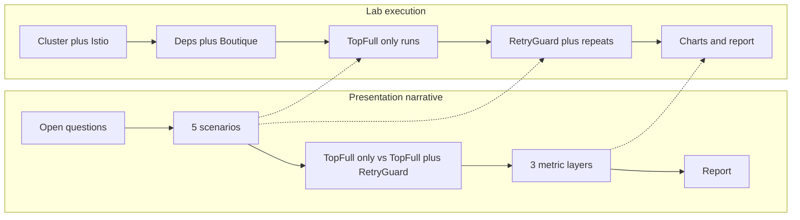

# Next Phases Plan (aligned with presentation prompt)

## Framing (presentation vs lab reality)

The NotebookLM prompt ([NOTEBOOKLM-PROMPT.md](NOTEBOOKLM-PROMPT.md)) describes **Ron Nezer’s pre-provisioned lab environment**. Your actual path is the **copied GCP VMs** in `networks-workshop` (`topfull-master` / `topfull-worker-1` / `topfull-load`, IPs in [infra/vm-ips.env](infra/vm-ips.env)).

**Slide language:** keep “Ron Nezer’s existing lab environment” / “pre-provisioned K8s + TopFull stack” — do not put Phase numbers or GCP resize details on slides.

**Internal work:** treat these VMs as that environment. **First action in Phase 2 is verify**, not blindly reinstall — the disks may already contain Docker/K8s from the source project.

**Cost rule:** stop the 3 VMs when not working (`gcloud compute instances stop ...`). Refresh public IPs after start.

---

## Track A — Presentation (parallel, Week 1)

Use [NOTEBOOKLM-PROMPT.md](NOTEBOOKLM-PROMPT.md) + [PRESENTATION-GUIDE.md](PRESENTATION-GUIDE.md) + [PRESENTATION-ACTION-ITEMS.md](PRESENTATION-ACTION-ITEMS.md).

- Build the **10-section** deck (~20–25 slides) in the exact order: Opening → Goal → TopFull → RetryGuard → Stack → How We Test → **What We Want to Find Out** → Load Scenarios → Metrics → Timeline.
- Text-first; no Phase numbers on slides; labels **TopFull only** / **TopFull + RetryGuard**.
- Timeline slide (audience-facing):

| What | When |
|------|------|
| Infrastructure — env, Istio, app running | Week 1–2 |
| Baseline — TopFull only | Week 2–3 |
| RetryGuard implementation + Istio integration | Week 3 |
| Experiment — TopFull + RetryGuard | Week 3–4 |
| Evaluation + final report | Week 4 |

- Team tasks from action items: architecture diagram, one-page test matrix, mentor/Itai email thread.

---

## Track B — Lab Phases 2–7

Sources of truth for commands: [SETUP-GUIDE.md](SETUP-GUIDE.md), [WORKPLAN.md](WORKPLAN.md), TopFull README.

### Phase 2 — Cluster + Istio (maps to “Infrastructure setup”)

1. **Audit first** on master/worker: `docker`, `cri-docker`, `kubeadm`/`kubectl` versions, `kubectl get nodes`, Istio (`istiod`).
2. If cluster is healthy after the copy → fix configs/IPs only; if broken → follow SETUP-GUIDE 2a–2g (Docker + cri-dockerd, K8s 1.26, Calico, join worker, cAdvisor).
3. Install/verify **Istio 1.17.x** (WORKPLAN 2h): minimal profile, `istio-injection=enabled` on `default`.
4. **Done when:** nodes Ready; `istiod` Running; screenshot saved.

### Phase 3 — Dependencies (maps to stack readiness)

- Master: Python venv + TopFull `requirements.txt`; Go 1.13.8 for proxy.
- Loadgen: Locust from `TopFull_loadgen/requirements.txt`.
- **Done when:** imports work; `locust --version` on loadgen.

### Phase 4 — Configure + deploy Online Boutique (maps to “app running”)

- Point [global_config.json](https://github.com/kaist-ina/TopFull) and hardcoded paths at current master/loadgen private IPs (`10.128.0.3` / `10.128.0.2` — refresh if needed).
- Fix `resource_collector.py` for **1 worker**.
- Deploy Boutique + metrics-server; expect **2/2** containers (app + Envoy).
- `instance_scaling.py`; smoke `curl` frontend `:30440`.
- **Done when:** frontend 200; sidecars present.

### Phase 5 — TopFull only (presentation “baseline”)

Run order on master: Go proxy `:8090` → `deploy_rl.py` → metrics collectors; on loadgen: Locust scripts.

Execute the **five scenarios** from the prompt (each with **multiple runs**):

| Scenario | Purpose (open question) |
|----------|-------------------------|
| 1 Normal Operation | RetryGuard non-intrusive when healthy (sanity) |
| 2 Sustained Overload 5–10 min | Core: system gains, beneficiaries, chain, controller interaction |
| 3 Targeted Bottleneck | Surgical vs blunt TopFull throttling |
| 4 Topology Position (ProductCatalog vs Payment) | Direct vs Checkout-mediated control |
| 5 Re-enable interval (10/20/30/60s) | Only meaningful once RetryGuard exists — run fully in Phase 6 |

For Phase 5: run scenarios **1–4** with RetryGuard **off**; save CSVs under consistent folders e.g. `baseline_topfull_<scenario>_run<N>/`.

**Done when:** multi-run TopFull-only logs exist for scenarios 1–4.

### Phase 6 — RetryGuard + comparison (presentation “experiment”)

1. Implement controller (plain-language behavior from prompt / paper Sec. 4 + 6.2): poll rejection (~20%, ~30s windows) → patch Istio VirtualService `retries.attempts` per service via Kubernetes Python client.
2. Create VirtualServices for Boutique services; verify manual patch toggle.
3. Repeat **identical** scenarios 1–4 with RetryGuard **on**; run scenario **5** (interval sweep).
4. Log controller decisions (which service toggled, when) for metric Layer 3.

**Done when:** paired TopFull-only vs TopFull+RetryGuard datasets + interval sweep.

### Phase 7 — Evaluation + report (presentation Metrics + deliverables)

Three layers from the prompt:

1. **Performance** — goodput, latency, rejection, **retries/request** (`metric_collector.py`)
2. **Resources** — CPU/mem, instance counts (`resource_collector.py` / cAdvisor)
3. **Controller state** — RetryGuard toggle timeline; cross-ref TopFull `overload_detection.py`

Deliverables: time-series charts comparing arms; short report answering the open questions (system gain may be small; per-service gains may be large).

---

## Experiment discipline (from prompt — non-negotiable)

- Same Locust scenario, duration, replicas for both arms; **only** RetryGuard on/off (or interval) changes.
- Multiple runs per cell; compare averages/medians.
- Collectors: TopFull entry metrics **and** Istio/Envoy per-service signals — cross-reference when interpreting.
- Out of scope unless mentors expand: DAGOR, DiffTry.

---

## Suggested near-term order (this week)

1. Stop VMs if idle; start only when working Phase 2 audit.
2. Phase 2 audit → repair or rebuild → Istio.
3. In parallel: NotebookLM/deck from the prompt; one-page scenario×metrics matrix.
4. Then Phase 3–4 until frontend smoke test passes — that closes “Week 1–2 infrastructure” on the timeline slide.
