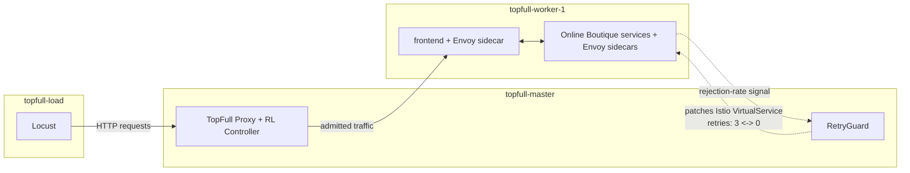

# RetryGuard on TopFull — Mentor Update

> **What this is:** a progress update for our mentors, not the final report. It covers the infrastructure we ran on, the test application (Online Boutique), the scenarios we ran, and the dry results gathered so far from our 48-run paper-grade campaign. Each results section shows charts with short factual observations — no conclusions or recommendations yet. Use this to tell us what looks sufficient and what's missing.
>
> Data source: `experiments/results/campaign_48/` (48 runs, all collectors enabled, 3 repeats per condition).

---

## 1. Infrastructure & Environment

We run on 3 Google Cloud VMs (project `networks-workshop`, zone `us-central1-a`):

| VM | Role |
|---|---|
| `topfull-master` | Kubernetes control plane, Istio control plane, TopFull's proxy + RL rate controller, RetryGuard |
| `topfull-worker-1` | All Online Boutique pods, each with an Envoy sidecar (Istio's service mesh proxy) |
| `topfull-load` | Locust load generator |

The stack is a self-managed Kubernetes cluster (`kubeadm`, not a managed GKE cluster) running Istio as the service mesh. Every Online Boutique service pod has an Envoy sidecar that Istio injects; all inter-service traffic goes through these sidecars, which is what makes Istio's retry policy (and RetryGuard's control over it) possible.

- **TopFull** sits in front of the cluster as an entry-point proxy plus a reinforcement-learning controller that throttles admitted traffic per API when it detects overload.
- **RetryGuard** (our own implementation, built from its paper) watches per-service rejection rates via the Envoy sidecars and disables/re-enables Istio's retry policy (`attempts: 3` → `attempts: 0` and back) on a per-service basis when rejection crosses a threshold.
- **Locust** generates the offered load from `topfull-load`, simulating users browsing/buying on Online Boutique.

---

## 2. Online Boutique — Role & Architecture

[Online Boutique](https://github.com/GoogleCloudPlatform/microservices-demo) is Google's reference e-commerce microservices demo — a real, polyglot, 10+ service application with a realistic call graph, which is why it's a good stand-in for "a production-like microservice system" in this workshop rather than a toy app.

Services we specifically constrain (CPU-limit) in later scenarios to create a controlled bottleneck:

| Service | Constrained in | Position in the call graph |
|---|---|---|
| `checkoutservice` | Scenario 3 | Critical path: Frontend → Checkout → {Cart, Shipping, Currency, ProductCatalog, Email, Payment} |
| `productcatalogservice` | Scenario 4A | Gateway-adjacent — Frontend calls it directly on many product-browse paths |
| `paymentservice` | Scenario 4B | Indirect — reachable only via Frontend → Checkout → Payment |

All services run at a fixed 1 replica in both conditions (no autoscaling), so any effect we see is due to retry behavior and CPU limits, not replica count changes.

---

## 3. Scenarios — High Level

Each scenario is run under two conditions with identical load: **Baseline** (TopFull only, Istio default retries, RetryGuard off) and **RetryGuard** (same, plus RetryGuard toggling retries per service). Every combination is repeated 3 times (Locust traffic is non-deterministic).

| # | Scenario | What changes | Duration | Open question(s) targeted |
|---|---|---|---|---|
| 1 | Normal Operation | Flat load, well within capacity | 5 min | Sanity check — RetryGuard should stay inert |
| 2 | Sustained Overload | Peak load from t=0, held flat | 10 min | System-level gains, topology beneficiaries, chain propagation |
| 3 | Targeted Bottleneck | `checkoutservice` CPU-limited | 10 min | Topology beneficiaries, chain propagation |
| 4A / 4B | Topology Position | `productcatalogservice` (A) vs `paymentservice` (B) CPU-limited | 10 min | Topology position sensitivity |
| 5 | Re-enable Interval Tuning | Same load as S6; re-enable window swept 10/20/30/60s | 15 min | Interval parameter sensitivity |
| 6 | Forced Recovery | Peak 5 min, then ~25% load for 10 min | 15 min | Combined equilibrium; also the reference for Scenario 5 |

Section 4 walks through the dry results for each of these, grouping Scenario 5 into Scenario 6's subsection since S5 has no baseline of its own — it's only meaningful compared against S6.
