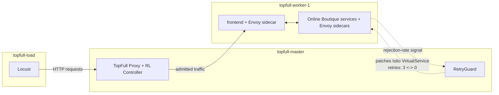

# Mentor Update Doc Implementation Plan

> **For agentic workers:** REQUIRED SUB-SKILL: Use superpowers:subagent-driven-development (recommended) or superpowers:executing-plans to implement this plan task-by-task. Steps use checkbox (`- [ ]`) syntax for tracking.

**Goal:** Build a chart-generation script over `experiments/results/campaign_48/` and a mentor-facing markdown doc (`Guides and Info/mentor-update/MENTOR-UPDATE.md`) that presents infrastructure, Online Boutique architecture, scenario overview, and per-scenario dry results with embedded charts.

**Architecture:** A pure-data module (`mentor_charts_data.py`, no plotting) loads and aggregates CSVs from campaign run folders into pandas objects; a plotting module (`mentor_charts_plots.py`) turns those into matplotlib PNGs; an orchestration script (`mentor_charts.py`) wires a per-scenario registry to both, producing an exhaustive gallery and a curated subset. The markdown doc is then hand-written, embedding the curated subset.

**Tech Stack:** Python 3.11, pandas, matplotlib, `unittest` (matching existing `experiments/test_*.py` convention). No new external services; everything runs locally against already-downloaded CSVs.

## Global Constraints

- Data source is **`experiments/results/campaign_48/` only**. Never read from `experiments/results/august_38/`.
- Campaign folder layout (already on disk, do not change it): `campaign_48/<scenario_dir>/<prefix>_run<N>/<csv files>`.
- Scenario groups and their run-folder prefixes (exact, from `experiments/results/campaign_48/README.md`):
  | Scenario dir | Baseline prefix | RetryGuard prefix | Run numbers | Bottleneck endpoint CSV |
  |---|---|---|---|---|
  | `S1_normal_op` | `baseline_topfull_no_retryguard_normal_op` | `run_topfull_retryguard_normal_op` | 4,5,6 | none |
  | `S2_sustained_overload` | `baseline_topfull_no_retryguard_sustained_overload` | `run_topfull_retryguard_sustained_overload` | 4,5,6 | none |
  | `S3_targeted_bottleneck` | `baseline_topfull_no_retryguard_targeted_bottleneck` | `run_topfull_retryguard_targeted_bottleneck` | 4,5,6 | `postcheckout.csv` |
  | `S4A_topology_position_A` | `baseline_topfull_no_retryguard_topology_position_A` | `run_topfull_retryguard_topology_position_A` | 4,5,6 | `getproduct.csv` |
  | `S4B_topology_position_B` | `baseline_topfull_no_retryguard_topology_position_B` | `run_topfull_retryguard_topology_position_B` | 4,5,6 | `postcheckout.csv` |
  | `S5_interval_tuning` | none (RG only) | `run_topfull_retryguard_interval_{10,20,30,60}s` | 3,4,5 | n/a (merged into S6) |
  | `S6_forced_recovery` | `baseline_topfull_no_retryguard_forced_recovery` | `run_topfull_retryguard_forced_recovery` | 1,2,3 | none |
- Locust endpoint CSVs (`total.csv`, `getproduct.csv`, `postcheckout.csv`, `getcart.csv`, `postcart.csv`, `emptycart.csv`) have columns `RPS,Fail,Goodput,Latency95,Latency99`, one row per second, no timestamp column — row index (0-based) is elapsed seconds. `Latency99` is always 0; never plot it.
- Envoy retry CSVs (`envoy_retries_frontend.csv`, `envoy_retries_checkoutservice.csv`) have columns `timestamp,target_service,upstream_rq_total,upstream_rq_retry,upstream_rq_retry_success,upstream_rq_retry_limit_exceeded`; timestamps are UTC strings formatted `%Y-%m-%dT%H:%M:%SZ`; counters are cumulative since pod start — must be diffed.
- `resource_usage.csv` has columns `timestamp,service,cpu_millicores,memory_working_set_bytes,replica_count`; same timestamp format as above; `replica_count` is always 1, never plot it.
- `retryguard.log` lines are space-separated with a leading UTC timestamp (same format), and toggle lines look like `2026-09-05T16:53:18Z  checkoutservice  ON→OFF   rejection=0.60  consecutive_high=2  attempts=0` (also `OFF→ON`). Only baseline runs lack this file (RetryGuard doesn't run).
- Existing test convention: `unittest`, one `test_<module>.py` per module, runnable as `python experiments/test_<module>.py`, with `sys.path.insert(0, str(Path(__file__).resolve().parent))` before importing the sibling module under test.
- Output doc location: `Guides and Info/mentor-update/MENTOR-UPDATE.md`, curated charts under `Guides and Info/mentor-update/charts/<Sx>/`, full gallery under `Guides and Info/mentor-update/charts_gallery/<Sx>/`.
- The doc never includes a conclusions/recommendations/sufficiency-verdict section. Observation bullets are factual only.
- Design spec of record: `docs/superpowers/specs/2026-09-06-mentor-update-doc-design.md`.

---

## Task 1: Data module — run discovery, column loading, repeat averaging

**Files:**
- Create: `experiments/mentor_charts_data.py`
- Test: `experiments/test_mentor_charts_data.py`

**Interfaces:**
- Produces: `find_run_dirs(scenario_dir: Path, prefix: str) -> list[Path]`, `load_metric_column(run_dirs: list[Path], csv_name: str, column: str) -> list[pd.Series]`, `average_series(series_list: list[pd.Series]) -> pd.DataFrame` (columns `mean`, `min`, `max`, index = elapsed seconds as plain `RangeIndex`).

- [ ] **Step 1: Write the failing tests**

Create `experiments/test_mentor_charts_data.py`:

```python
"""
test_mentor_charts_data.py — Unit tests for mentor_charts_data.py (pure
data loading/aggregation, no plotting, no network access).

Run:
    python experiments/test_mentor_charts_data.py
"""
from __future__ import annotations

import sys
import tempfile
import unittest
from pathlib import Path

import pandas as pd

sys.path.insert(0, str(Path(__file__).resolve().parent))

import mentor_charts_data as mcd


class TestFindRunDirs(unittest.TestCase):
    def test_finds_and_sorts_matching_run_dirs(self):
        with tempfile.TemporaryDirectory() as tmp:
            scenario_dir = Path(tmp)
            (scenario_dir / "baseline_foo_run5").mkdir()
            (scenario_dir / "baseline_foo_run4").mkdir()
            (scenario_dir / "baseline_foo_run6").mkdir()
            (scenario_dir / "run_topfull_retryguard_foo_run4").mkdir()
            (scenario_dir / "not_a_match").mkdir()

            result = mcd.find_run_dirs(scenario_dir, "baseline_foo")

            self.assertEqual(
                [p.name for p in result],
                ["baseline_foo_run4", "baseline_foo_run5", "baseline_foo_run6"],
            )

    def test_returns_empty_list_when_no_match(self):
        with tempfile.TemporaryDirectory() as tmp:
            result = mcd.find_run_dirs(Path(tmp), "baseline_foo")
            self.assertEqual(result, [])


class TestLoadMetricColumn(unittest.TestCase):
    def test_reads_column_from_each_run_dir(self):
        with tempfile.TemporaryDirectory() as tmp:
            run_a = Path(tmp) / "run_a"
            run_b = Path(tmp) / "run_b"
            run_a.mkdir()
            run_b.mkdir()
            pd.DataFrame({"RPS": [1.0, 2.0], "Goodput": [1.0, 2.0]}).to_csv(
                run_a / "total.csv", index=False
            )
            pd.DataFrame({"RPS": [3.0, 4.0, 5.0], "Goodput": [3.0, 4.0, 5.0]}).to_csv(
                run_b / "total.csv", index=False
            )

            result = mcd.load_metric_column([run_a, run_b], "total.csv", "Goodput")

            self.assertEqual(len(result), 2)
            self.assertEqual(list(result[0]), [1.0, 2.0])
            self.assertEqual(list(result[1]), [3.0, 4.0, 5.0])


class TestAverageSeries(unittest.TestCase):
    def test_truncates_to_shortest_and_averages_pointwise(self):
        series_list = [
            pd.Series([10.0, 20.0, 30.0]),
            pd.Series([0.0, 10.0]),
        ]

        result = mcd.average_series(series_list)

        self.assertEqual(list(result.index), [0, 1])
        self.assertEqual(list(result["mean"]), [5.0, 15.0])
        self.assertEqual(list(result["min"]), [0.0, 10.0])
        self.assertEqual(list(result["max"]), [10.0, 20.0])

    def test_empty_input_returns_empty_dataframe(self):
        result = mcd.average_series([])
        self.assertTrue(result.empty)
        self.assertEqual(list(result.columns), ["mean", "min", "max"])


if __name__ == "__main__":
    unittest.main()
```

- [ ] **Step 2: Run tests to verify they fail**

Run: `python experiments/test_mentor_charts_data.py`
Expected: `ModuleNotFoundError: No module named 'mentor_charts_data'`

- [ ] **Step 3: Write the implementation**

Create `experiments/mentor_charts_data.py`:

```python
"""
mentor_charts_data.py — Pure data loading and aggregation helpers over
experiments/results/campaign_48/ run folders. No plotting, no network
access; every function takes explicit paths/DataFrames and returns
pandas objects.
"""
from __future__ import annotations

import re
from datetime import datetime, timezone
from pathlib import Path

import pandas as pd

CAMPAIGN_ROOT = Path(__file__).resolve().parent / "results" / "campaign_48"


def find_run_dirs(scenario_dir: Path, prefix: str) -> list[Path]:
    """Return the run folders directly under scenario_dir whose name
    matches '<prefix>_run<N>' (N numeric), sorted by run number ascending."""
    pattern = re.compile(rf"^{re.escape(prefix)}_run(\d+)$")
    matches: list[tuple[int, Path]] = []
    for child in scenario_dir.iterdir():
        if not child.is_dir():
            continue
        m = pattern.match(child.name)
        if m:
            matches.append((int(m.group(1)), child))
    matches.sort(key=lambda pair: pair[0])
    return [path for _, path in matches]


def load_metric_column(
    run_dirs: list[Path], csv_name: str, column: str
) -> list[pd.Series]:
    """Read `column` from `csv_name` in each run dir. Each returned Series
    has a plain 0-based RangeIndex; for the per-second Locust CSVs this
    index IS elapsed seconds."""
    series_list = []
    for run_dir in run_dirs:
        df = pd.read_csv(run_dir / csv_name)
        series_list.append(df[column].reset_index(drop=True))
    return series_list


def average_series(series_list: list[pd.Series]) -> pd.DataFrame:
    """Truncate every series to the length of the shortest one, then
    return a DataFrame with columns 'mean', 'min', 'max' computed
    pointwise (row-by-row) across the input series."""
    if not series_list:
        return pd.DataFrame(columns=["mean", "min", "max"])
    min_len = min(len(s) for s in series_list)
    truncated = [s.iloc[:min_len].reset_index(drop=True) for s in series_list]
    stacked = pd.concat(truncated, axis=1)
    return pd.DataFrame(
        {
            "mean": stacked.mean(axis=1),
            "min": stacked.min(axis=1),
            "max": stacked.max(axis=1),
        }
    )


def _parse_ts(ts: str) -> datetime:
    return datetime.strptime(ts.strip(), "%Y-%m-%dT%H:%M:%SZ").replace(
        tzinfo=timezone.utc
    )
```

- [ ] **Step 4: Run tests to verify they pass**

Run: `python experiments/test_mentor_charts_data.py`
Expected: `OK` (4 tests)

- [ ] **Step 5: Commit**

```powershell
git add experiments/mentor_charts_data.py experiments/test_mentor_charts_data.py
git commit -m "feat: add run-dir discovery and repeat-averaging helpers for mentor charts"
```

---

## Task 2: Data module — rejection-rate derivation

**Files:**
- Modify: `experiments/mentor_charts_data.py`
- Modify: `experiments/test_mentor_charts_data.py`

**Interfaces:**
- Consumes: nothing new from Task 1's public functions.
- Produces: `rejection_rate_series(run_dirs: list[Path], csv_name: str) -> list[pd.Series]`.

- [ ] **Step 1: Write the failing test**

Add to `experiments/test_mentor_charts_data.py` (before the `if __name__` block):

```python
class TestRejectionRateSeries(unittest.TestCase):
    def test_computes_fail_over_rps_with_zero_rps_guard(self):
        with tempfile.TemporaryDirectory() as tmp:
            run_dir = Path(tmp) / "run_a"
            run_dir.mkdir()
            pd.DataFrame(
                {"RPS": [0.0, 50.0, 20.0], "Fail": [0.0, 0.0, 19.6]}
            ).to_csv(run_dir / "total.csv", index=False)

            result = mcd.rejection_rate_series([run_dir], "total.csv")

            self.assertEqual(len(result), 1)
            values = list(result[0])
            self.assertAlmostEqual(values[0], 0.0)
            self.assertAlmostEqual(values[1], 0.0)
            self.assertAlmostEqual(values[2], 0.98)
```

- [ ] **Step 2: Run test to verify it fails**

Run: `python experiments/test_mentor_charts_data.py`
Expected: `AttributeError: module 'mentor_charts_data' has no attribute 'rejection_rate_series'`

- [ ] **Step 3: Write the implementation**

Append to `experiments/mentor_charts_data.py`:

```python
def rejection_rate_series(run_dirs: list[Path], csv_name: str) -> list[pd.Series]:
    """Compute Fail/RPS per row for each run dir's csv_name (0.0 where
    RPS == 0, since there was no offered load to reject)."""
    series_list = []
    for run_dir in run_dirs:
        df = pd.read_csv(run_dir / csv_name)
        rate = (df["Fail"] / df["RPS"].replace(0, pd.NA)).fillna(0.0)
        series_list.append(rate.reset_index(drop=True))
    return series_list
```

- [ ] **Step 4: Run tests to verify they pass**

Run: `python experiments/test_mentor_charts_data.py`
Expected: `OK` (5 tests)

- [ ] **Step 5: Commit**

```powershell
git add experiments/mentor_charts_data.py experiments/test_mentor_charts_data.py
git commit -m "feat: add rejection-rate derivation for mentor charts"
```

---

## Task 3: Data module — Envoy retries-per-request derivation

**Files:**
- Modify: `experiments/mentor_charts_data.py`
- Modify: `experiments/test_mentor_charts_data.py`

**Interfaces:**
- Consumes: `_parse_ts` (Task 1, private).
- Produces: `envoy_retries_per_request(run_dir: Path, csv_name: str) -> pd.DataFrame` (index = `elapsed_seconds` float, one column per `target_service` plus a `total` column).

- [ ] **Step 1: Write the failing test**

Add to `experiments/test_mentor_charts_data.py`:

```python
class TestEnvoyRetriesPerRequest(unittest.TestCase):
    def test_diffs_cumulative_counters_per_target_and_total(self):
        with tempfile.TemporaryDirectory() as tmp:
            run_dir = Path(tmp) / "run_a"
            run_dir.mkdir()
            rows = [
                # t=0: baseline poll, diffs are 0 (first row per target)
                ("2026-09-05T16:51:25Z", "cartservice", 1000, 0),
                ("2026-09-05T16:51:25Z", "checkoutservice", 2000, 10),
                # t=5: cartservice gets 100 new requests, 5 retries;
                #      checkoutservice gets 100 new requests, 0 new retries
                ("2026-09-05T16:51:30Z", "cartservice", 1100, 5),
                ("2026-09-05T16:51:30Z", "checkoutservice", 2100, 10),
            ]
            pd.DataFrame(
                rows,
                columns=["timestamp", "target_service", "upstream_rq_total", "upstream_rq_retry"],
            ).assign(upstream_rq_retry_success=0, upstream_rq_retry_limit_exceeded=0).to_csv(
                run_dir / "envoy_retries_frontend.csv", index=False
            )

            result = mcd.envoy_retries_per_request(run_dir, "envoy_retries_frontend.csv")

            self.assertEqual(list(result.index), [0.0, 5.0])
            self.assertAlmostEqual(result.loc[0.0, "cartservice"], 0.0)
            self.assertAlmostEqual(result.loc[5.0, "cartservice"], 0.05)
            self.assertAlmostEqual(result.loc[5.0, "checkoutservice"], 0.0)
            # total: (5 + 0) retries over (100 + 100) requests = 0.025
            self.assertAlmostEqual(result.loc[5.0, "total"], 0.025)


if __name__ == "__main__":
    unittest.main()
```

(Remove the duplicate trailing `if __name__ == "__main__": unittest.main()` block so there is only one at the end of the file.)

- [ ] **Step 2: Run test to verify it fails**

Run: `python experiments/test_mentor_charts_data.py`
Expected: `AttributeError: module 'mentor_charts_data' has no attribute 'envoy_retries_per_request'`

- [ ] **Step 3: Write the implementation**

Append to `experiments/mentor_charts_data.py`:

```python
def envoy_retries_per_request(run_dir: Path, csv_name: str) -> pd.DataFrame:
    """Read an envoy_retries_*.csv file and compute retries-per-request
    per target_service by differencing consecutive cumulative rows.
    Returns a DataFrame indexed by elapsed_seconds (relative to the
    file's earliest timestamp) with one column per target_service plus
    a 'total' column (summed retry/total diffs across target services
    at each poll, then divided)."""
    df = pd.read_csv(run_dir / csv_name)
    df["timestamp"] = df["timestamp"].map(_parse_ts)
    t0 = df["timestamp"].min()
    df["elapsed_seconds"] = (df["timestamp"] - t0).dt.total_seconds()

    columns: dict[str, pd.Series] = {}
    for target, group in df.groupby("target_service", sort=True):
        group = group.sort_values("elapsed_seconds").reset_index(drop=True)
        d_retry = group["upstream_rq_retry"].diff().fillna(0.0)
        d_total = group["upstream_rq_total"].diff().fillna(0.0)
        rate = (d_retry / d_total.replace(0, pd.NA)).fillna(0.0)
        columns[target] = pd.Series(
            rate.to_numpy(), index=group["elapsed_seconds"].to_numpy()
        )
    result = pd.DataFrame(columns).sort_index()

    totals = (
        df.groupby("elapsed_seconds")[["upstream_rq_retry", "upstream_rq_total"]]
        .sum()
        .sort_index()
    )
    d_retry_total = totals["upstream_rq_retry"].diff().fillna(0.0)
    d_total_total = totals["upstream_rq_total"].diff().fillna(0.0)
    result["total"] = (
        (d_retry_total / d_total_total.replace(0, pd.NA)).fillna(0.0).to_numpy()
    )
    return result
```

- [ ] **Step 4: Run tests to verify they pass**

Run: `python experiments/test_mentor_charts_data.py`
Expected: `OK` (6 tests)

- [ ] **Step 5: Commit**

```powershell
git add experiments/mentor_charts_data.py experiments/test_mentor_charts_data.py
git commit -m "feat: add envoy retries-per-request derivation for mentor charts"
```

---

## Task 4: Data module — resource usage series and cross-repeat DataFrame averaging

**Files:**
- Modify: `experiments/mentor_charts_data.py`
- Modify: `experiments/test_mentor_charts_data.py`

**Interfaces:**
- Consumes: `_parse_ts` (Task 1, private).
- Produces: `resource_usage_series(run_dir: Path, column: str) -> pd.DataFrame` (index = `elapsed_seconds`, one column per service); `average_dataframes(dfs: list[pd.DataFrame]) -> pd.DataFrame` (positional row averaging across repeats, keeping only columns common to all inputs).

- [ ] **Step 1: Write the failing tests**

Add to `experiments/test_mentor_charts_data.py`:

```python
class TestResourceUsageSeries(unittest.TestCase):
    def test_pivots_by_service_indexed_by_elapsed_seconds(self):
        with tempfile.TemporaryDirectory() as tmp:
            run_dir = Path(tmp) / "run_a"
            run_dir.mkdir()
            rows = [
                ("2026-09-05T16:51:52Z", "frontend", 10, 1000),
                ("2026-09-05T16:51:52Z", "cartservice", 5, 2000),
                ("2026-09-05T16:51:57Z", "frontend", 12, 1100),
                ("2026-09-05T16:51:57Z", "cartservice", 6, 2100),
            ]
            pd.DataFrame(
                rows,
                columns=["timestamp", "service", "cpu_millicores", "memory_working_set_bytes"],
            ).assign(replica_count=1).to_csv(run_dir / "resource_usage.csv", index=False)

            result = mcd.resource_usage_series(run_dir, "cpu_millicores")

            self.assertEqual(list(result.index), [0.0, 5.0])
            self.assertEqual(list(result["frontend"]), [10, 12])
            self.assertEqual(list(result["cartservice"]), [5, 6])


class TestAverageDataFrames(unittest.TestCase):
    def test_averages_common_columns_positionally(self):
        df_a = pd.DataFrame({"x": [1.0, 2.0, 3.0], "y": [10.0, 20.0, 30.0]})
        df_b = pd.DataFrame({"x": [3.0, 4.0], "z": [100.0, 200.0]})

        result = mcd.average_dataframes([df_a, df_b])

        # only 'x' is common to both; shortest length is 2
        self.assertEqual(list(result.columns), ["x"])
        self.assertEqual(list(result["x"]), [2.0, 3.0])

    def test_empty_list_returns_empty_dataframe(self):
        result = mcd.average_dataframes([])
        self.assertTrue(result.empty)
```

- [ ] **Step 2: Run tests to verify they fail**

Run: `python experiments/test_mentor_charts_data.py`
Expected: `AttributeError: module 'mentor_charts_data' has no attribute 'resource_usage_series'`

- [ ] **Step 3: Write the implementation**

Append to `experiments/mentor_charts_data.py`:

```python
def resource_usage_series(run_dir: Path, column: str) -> pd.DataFrame:
    """Read resource_usage.csv from run_dir; return a DataFrame indexed by
    elapsed_seconds (relative to the file's earliest timestamp) with one
    column per service, containing the requested numeric column."""
    df = pd.read_csv(run_dir / "resource_usage.csv")
    df["timestamp"] = df["timestamp"].map(_parse_ts)
    t0 = df["timestamp"].min()
    df["elapsed_seconds"] = (df["timestamp"] - t0).dt.total_seconds()

    columns: dict[str, pd.Series] = {}
    for service, group in df.groupby("service", sort=True):
        group = group.sort_values("elapsed_seconds")
        columns[service] = pd.Series(
            group[column].to_numpy(), index=group["elapsed_seconds"].to_numpy()
        )
    return pd.DataFrame(columns).sort_index()


def average_dataframes(dfs: list[pd.DataFrame]) -> pd.DataFrame:
    """Positionally average a list of DataFrames (as produced by
    envoy_retries_per_request / resource_usage_series for different
    repeats of the same run group): truncate to the shortest row count,
    keep only columns present in every input, reset each to a plain
    row-number index, and return the pointwise mean."""
    if not dfs:
        return pd.DataFrame()
    common_columns = set(dfs[0].columns)
    for df in dfs[1:]:
        common_columns &= set(df.columns)
    common_columns = sorted(common_columns)
    min_len = min(len(df) for df in dfs)
    truncated = [
        df[common_columns].iloc[:min_len].reset_index(drop=True) for df in dfs
    ]
    stacked = pd.concat(truncated, axis=0, keys=range(len(truncated)))
    return stacked.groupby(level=1).mean()
```

- [ ] **Step 4: Run tests to verify they pass**

Run: `python experiments/test_mentor_charts_data.py`
Expected: `OK` (8 tests)

- [ ] **Step 5: Commit**

```powershell
git add experiments/mentor_charts_data.py experiments/test_mentor_charts_data.py
git commit -m "feat: add resource-usage series and cross-repeat DataFrame averaging"
```

---

## Task 5: Data module — RetryGuard toggle-event log parsing

**Files:**
- Modify: `experiments/mentor_charts_data.py`
- Modify: `experiments/test_mentor_charts_data.py`

**Interfaces:**
- Consumes: `_parse_ts` (Task 1, private).
- Produces: `parse_toggle_events(log_path: Path) -> list[dict]`, each dict `{"elapsed_seconds": float, "service": str, "direction": "ON→OFF" | "OFF→ON"}`.

- [ ] **Step 1: Write the failing test**

Add to `experiments/test_mentor_charts_data.py`:

```python
class TestParseToggleEvents(unittest.TestCase):
    def test_extracts_toggle_events_relative_to_first_timestamp(self):
        with tempfile.TemporaryDirectory() as tmp:
            log_path = Path(tmp) / "retryguard.log"
            log_path.write_text(
                "2026-09-05T16:52:18Z  START  threshold=0.20\n"
                "2026-09-05T16:52:48Z  OBSERVE  checkoutservice  rejection=0.3773  low=0 high=1  state=ON\n"
                "2026-09-05T16:53:18Z  checkoutservice  ON→OFF   rejection=0.60  consecutive_high=2  attempts=0\n"
                "2026-09-05T16:58:18Z  checkoutservice  OFF→ON   rejection=0.05  consecutive_low=3  attempts=3\n",
                encoding="utf-8",
            )

            events = mcd.parse_toggle_events(log_path)

            self.assertEqual(len(events), 2)
            self.assertEqual(events[0]["service"], "checkoutservice")
            self.assertEqual(events[0]["direction"], "ON→OFF")
            self.assertAlmostEqual(events[0]["elapsed_seconds"], 60.0)
            self.assertEqual(events[1]["direction"], "OFF→ON")
            self.assertAlmostEqual(events[1]["elapsed_seconds"], 360.0)

    def test_returns_empty_list_for_baseline_run_with_no_log(self):
        with tempfile.TemporaryDirectory() as tmp:
            log_path = Path(tmp) / "missing.log"
            self.assertFalse(log_path.exists())
```

- [ ] **Step 2: Run test to verify it fails**

Run: `python experiments/test_mentor_charts_data.py`
Expected: `AttributeError: module 'mentor_charts_data' has no attribute 'parse_toggle_events'`

- [ ] **Step 3: Write the implementation**

Append to `experiments/mentor_charts_data.py`:

```python
TOGGLE_PATTERN = re.compile(
    r"^(?P<ts>\S+)\s+(?P<service>\S+)\s+(?P<direction>ON→OFF|OFF→ON)\b"
)


def parse_toggle_events(log_path: Path) -> list[dict]:
    """Parse a retryguard.log file's ON→OFF / OFF→ON lines. Returns a
    list of {'elapsed_seconds', 'service', 'direction'} dicts, with
    elapsed_seconds relative to the log's earliest timestamped line."""
    lines = log_path.read_text(encoding="utf-8").splitlines()
    timestamps: list[datetime] = []
    raw_events: list[dict] = []
    for line in lines:
        parts = line.split(None, 1)
        if not parts:
            continue
        try:
            ts = _parse_ts(parts[0])
        except ValueError:
            continue
        timestamps.append(ts)
        match = TOGGLE_PATTERN.match(line)
        if match:
            raw_events.append(
                {
                    "timestamp": ts,
                    "service": match.group("service"),
                    "direction": match.group("direction"),
                }
            )
    if not timestamps:
        return []
    t0 = min(timestamps)
    return [
        {
            "elapsed_seconds": (e["timestamp"] - t0).total_seconds(),
            "service": e["service"],
            "direction": e["direction"],
        }
        for e in raw_events
    ]
```

- [ ] **Step 4: Run tests to verify they pass**

Run: `python experiments/test_mentor_charts_data.py`
Expected: `OK` (10 tests)

- [ ] **Step 5: Commit**

```powershell
git add experiments/mentor_charts_data.py experiments/test_mentor_charts_data.py
git commit -m "feat: add retryguard.log toggle-event parsing"
```

---

## Task 6: Plotting module — baseline-vs-RetryGuard time-series comparison chart

**Files:**
- Create: `experiments/mentor_charts_plots.py`
- Test: `experiments/test_mentor_charts_plots.py`

**Interfaces:**
- Consumes: `pd.DataFrame` shaped like `average_series`'s output (columns `mean`,`min`,`max`); toggle events shaped like `parse_toggle_events`'s output (Task 5).
- Produces: `plot_timeseries_comparison(baseline_avg: pd.DataFrame, rg_avg: pd.DataFrame, title: str, ylabel: str, out_path: Path, toggle_events: list[dict] | None = None) -> None`.

- [ ] **Step 1: Write the failing test**

Create `experiments/test_mentor_charts_plots.py`:

```python
"""
test_mentor_charts_plots.py — Smoke tests for mentor_charts_plots.py.
These verify each plotting function runs without error on small
synthetic data and writes a non-empty PNG; they do not inspect pixel
content.

Run:
    python experiments/test_mentor_charts_plots.py
"""
from __future__ import annotations

import sys
import tempfile
import unittest
from pathlib import Path

import pandas as pd

sys.path.insert(0, str(Path(__file__).resolve().parent))

import mentor_charts_plots as mcp


class TestPlotTimeseriesComparison(unittest.TestCase):
    def test_writes_nonempty_png_without_toggle_events(self):
        baseline_avg = pd.DataFrame(
            {"mean": [10.0, 12.0, 11.0], "min": [8.0, 10.0, 9.0], "max": [12.0, 14.0, 13.0]}
        )
        rg_avg = pd.DataFrame(
            {"mean": [10.0, 20.0, 25.0], "min": [9.0, 18.0, 23.0], "max": [11.0, 22.0, 27.0]}
        )
        with tempfile.TemporaryDirectory() as tmp:
            out_path = Path(tmp) / "chart.png"
            mcp.plot_timeseries_comparison(
                baseline_avg, rg_avg, title="Test", ylabel="Goodput", out_path=out_path
            )
            self.assertTrue(out_path.exists())
            self.assertGreater(out_path.stat().st_size, 0)

    def test_writes_nonempty_png_with_toggle_events(self):
        baseline_avg = pd.DataFrame({"mean": [10.0, 12.0], "min": [8.0, 10.0], "max": [12.0, 14.0]})
        rg_avg = pd.DataFrame({"mean": [10.0, 20.0], "min": [9.0, 18.0], "max": [11.0, 22.0]})
        toggle_events = [{"elapsed_seconds": 1.0, "service": "checkoutservice", "direction": "ON→OFF"}]
        with tempfile.TemporaryDirectory() as tmp:
            out_path = Path(tmp) / "chart.png"
            mcp.plot_timeseries_comparison(
                baseline_avg, rg_avg, title="Test", ylabel="Goodput",
                out_path=out_path, toggle_events=toggle_events,
            )
            self.assertTrue(out_path.exists())
            self.assertGreater(out_path.stat().st_size, 0)


if __name__ == "__main__":
    unittest.main()
```

- [ ] **Step 2: Run test to verify it fails**

Run: `python experiments/test_mentor_charts_plots.py`
Expected: `ModuleNotFoundError: No module named 'mentor_charts_plots'`

- [ ] **Step 3: Write the implementation**

Create `experiments/mentor_charts_plots.py`:

```python
"""
mentor_charts_plots.py — matplotlib chart builders consuming the
pandas objects produced by mentor_charts_data.py. Every function writes
a PNG to an explicit out_path and returns None.
"""
from __future__ import annotations

from pathlib import Path

import matplotlib

matplotlib.use("Agg")
import matplotlib.pyplot as plt
import pandas as pd

_TOGGLE_COLORS = {"ON→OFF": "tab:red", "OFF→ON": "tab:green"}


def plot_timeseries_comparison(
    baseline_avg: pd.DataFrame,
    rg_avg: pd.DataFrame,
    title: str,
    ylabel: str,
    out_path: Path,
    toggle_events: list[dict] | None = None,
) -> None:
    """Plot baseline vs RetryGuard mean lines (with min/max shaded band)
    against elapsed seconds. If toggle_events is given (from
    mentor_charts_data.parse_toggle_events), draw a vertical dashed line
    per event, colored red for ON→OFF and green for OFF→ON, labeled with
    the service name."""
    fig, ax = plt.subplots(figsize=(9, 4.5))

    if not baseline_avg.empty:
        ax.plot(baseline_avg.index, baseline_avg["mean"], label="Baseline (TopFull only)", color="tab:blue")
        ax.fill_between(baseline_avg.index, baseline_avg["min"], baseline_avg["max"], color="tab:blue", alpha=0.15)
    if not rg_avg.empty:
        ax.plot(rg_avg.index, rg_avg["mean"], label="TopFull + RetryGuard", color="tab:orange")
        ax.fill_between(rg_avg.index, rg_avg["min"], rg_avg["max"], color="tab:orange", alpha=0.15)

    for event in toggle_events or []:
        color = _TOGGLE_COLORS.get(event["direction"], "gray")
        ax.axvline(event["elapsed_seconds"], color=color, linestyle="--", linewidth=1, alpha=0.7)

    ax.set_title(title)
    ax.set_xlabel("Elapsed seconds")
    ax.set_ylabel(ylabel)
    ax.legend(loc="best")
    fig.tight_layout()
    out_path.parent.mkdir(parents=True, exist_ok=True)
    fig.savefig(out_path, dpi=120)
    plt.close(fig)
```

- [ ] **Step 4: Run tests to verify they pass**

Run: `python experiments/test_mentor_charts_plots.py`
Expected: `OK` (2 tests)

- [ ] **Step 5: Commit**

```powershell
git add experiments/mentor_charts_plots.py experiments/test_mentor_charts_plots.py
git commit -m "feat: add baseline-vs-retryguard timeseries comparison chart"
```

---

## Task 7: Plotting module — multi-line overlay chart (CPU/memory/retries-per-target)

**Files:**
- Modify: `experiments/mentor_charts_plots.py`
- Modify: `experiments/test_mentor_charts_plots.py`

**Interfaces:**
- Consumes: `pd.DataFrame` shaped like `resource_usage_series`/`average_dataframes`/`envoy_retries_per_request` output (one column per line, index = elapsed seconds or row number).
- Produces: `plot_multi_line(df: pd.DataFrame, title: str, ylabel: str, out_path: Path) -> None`.

- [ ] **Step 1: Write the failing test**

Add to `experiments/test_mentor_charts_plots.py`:

```python
class TestPlotMultiLine(unittest.TestCase):
    def test_writes_nonempty_png_with_one_line_per_column(self):
        df = pd.DataFrame(
            {"frontend": [10.0, 12.0, 11.0], "cartservice": [5.0, 6.0, 7.0]},
            index=[0.0, 5.0, 10.0],
        )
        with tempfile.TemporaryDirectory() as tmp:
            out_path = Path(tmp) / "chart.png"
            mcp.plot_multi_line(df, title="Test", ylabel="CPU (millicores)", out_path=out_path)
            self.assertTrue(out_path.exists())
            self.assertGreater(out_path.stat().st_size, 0)

    def test_handles_empty_dataframe_without_raising(self):
        df = pd.DataFrame()
        with tempfile.TemporaryDirectory() as tmp:
            out_path = Path(tmp) / "chart.png"
            mcp.plot_multi_line(df, title="Test", ylabel="CPU", out_path=out_path)
            self.assertTrue(out_path.exists())
```

- [ ] **Step 2: Run tests to verify they fail**

Run: `python experiments/test_mentor_charts_plots.py`
Expected: `AttributeError: module 'mentor_charts_plots' has no attribute 'plot_multi_line'`

- [ ] **Step 3: Write the implementation**

Append to `experiments/mentor_charts_plots.py`:

```python
def plot_multi_line(df: pd.DataFrame, title: str, ylabel: str, out_path: Path) -> None:
    """Plot one line per column of df against its index (elapsed seconds
    or row number). Used for CPU/memory-per-service overlays and
    retries-per-target-service overlays. Handles an empty DataFrame by
    still writing an (empty) chart, so orchestration code never has to
    special-case missing data."""
    fig, ax = plt.subplots(figsize=(9, 4.5))
    for column in df.columns:
        ax.plot(df.index, df[column], label=str(column))
    ax.set_title(title)
    ax.set_xlabel("Elapsed seconds")
    ax.set_ylabel(ylabel)
    if not df.empty:
        ax.legend(loc="best", fontsize="small")
    fig.tight_layout()
    out_path.parent.mkdir(parents=True, exist_ok=True)
    fig.savefig(out_path, dpi=120)
    plt.close(fig)
```

- [ ] **Step 4: Run tests to verify they pass**

Run: `python experiments/test_mentor_charts_plots.py`
Expected: `OK` (4 tests)

- [ ] **Step 5: Commit**

```powershell
git add experiments/mentor_charts_plots.py experiments/test_mentor_charts_plots.py
git commit -m "feat: add multi-line overlay chart for CPU/memory/retries"
```

---

## Task 8: Plotting module — S4 side-by-side (A vs B) composer

**Files:**
- Modify: `experiments/mentor_charts_plots.py`
- Modify: `experiments/test_mentor_charts_plots.py`

**Interfaces:**
- Consumes: two pairs of `(baseline_avg, rg_avg)` DataFrames shaped like Task 6's inputs, one pair for position A and one for position B.
- Produces: `plot_side_by_side_comparison(pair_a: tuple[pd.DataFrame, pd.DataFrame], pair_b: tuple[pd.DataFrame, pd.DataFrame], title: str, ylabel: str, label_a: str, label_b: str, out_path: Path) -> None`.

- [ ] **Step 1: Write the failing test**

Add to `experiments/test_mentor_charts_plots.py`:

```python
class TestPlotSideBySideComparison(unittest.TestCase):
    def test_writes_nonempty_png_with_two_panels(self):
        baseline_a = pd.DataFrame({"mean": [10.0, 11.0], "min": [9.0, 10.0], "max": [11.0, 12.0]})
        rg_a = pd.DataFrame({"mean": [10.0, 15.0], "min": [9.0, 14.0], "max": [11.0, 16.0]})
        baseline_b = pd.DataFrame({"mean": [8.0, 9.0], "min": [7.0, 8.0], "max": [9.0, 10.0]})
        rg_b = pd.DataFrame({"mean": [8.0, 12.0], "min": [7.0, 11.0], "max": [9.0, 13.0]})
        with tempfile.TemporaryDirectory() as tmp:
            out_path = Path(tmp) / "chart.png"
            mcp.plot_side_by_side_comparison(
                pair_a=(baseline_a, rg_a),
                pair_b=(baseline_b, rg_b),
                title="Test",
                ylabel="Goodput",
                label_a="S4A: ProductCatalog",
                label_b="S4B: Payment",
                out_path=out_path,
            )
            self.assertTrue(out_path.exists())
            self.assertGreater(out_path.stat().st_size, 0)
```

- [ ] **Step 2: Run test to verify it fails**

Run: `python experiments/test_mentor_charts_plots.py`
Expected: `AttributeError: module 'mentor_charts_plots' has no attribute 'plot_side_by_side_comparison'`

- [ ] **Step 3: Write the implementation**

Append to `experiments/mentor_charts_plots.py`:

```python
def _draw_comparison_panel(ax, baseline_avg: pd.DataFrame, rg_avg: pd.DataFrame, subtitle: str, ylabel: str) -> None:
    if not baseline_avg.empty:
        ax.plot(baseline_avg.index, baseline_avg["mean"], label="Baseline", color="tab:blue")
        ax.fill_between(baseline_avg.index, baseline_avg["min"], baseline_avg["max"], color="tab:blue", alpha=0.15)
    if not rg_avg.empty:
        ax.plot(rg_avg.index, rg_avg["mean"], label="RetryGuard", color="tab:orange")
        ax.fill_between(rg_avg.index, rg_avg["min"], rg_avg["max"], color="tab:orange", alpha=0.15)
    ax.set_title(subtitle)
    ax.set_xlabel("Elapsed seconds")
    ax.set_ylabel(ylabel)
    ax.legend(loc="best", fontsize="small")


def plot_side_by_side_comparison(
    pair_a: tuple[pd.DataFrame, pd.DataFrame],
    pair_b: tuple[pd.DataFrame, pd.DataFrame],
    title: str,
    ylabel: str,
    label_a: str,
    label_b: str,
    out_path: Path,
) -> None:
    """Draw a two-panel figure: left panel is pair_a's baseline-vs-RG
    comparison (S4A), right panel is pair_b's (S4B), sharing the y-axis
    scale so the two positions are visually comparable."""
    fig, (ax_a, ax_b) = plt.subplots(1, 2, figsize=(13, 4.5), sharey=True)
    _draw_comparison_panel(ax_a, pair_a[0], pair_a[1], label_a, ylabel)
    _draw_comparison_panel(ax_b, pair_b[0], pair_b[1], label_b, ylabel)
    fig.suptitle(title)
    fig.tight_layout()
    out_path.parent.mkdir(parents=True, exist_ok=True)
    fig.savefig(out_path, dpi=120)
    plt.close(fig)
```

- [ ] **Step 4: Run tests to verify they pass**

Run: `python experiments/test_mentor_charts_plots.py`
Expected: `OK` (5 tests)

- [ ] **Step 5: Commit**

```powershell
git add experiments/mentor_charts_plots.py experiments/test_mentor_charts_plots.py
git commit -m "feat: add S4 side-by-side comparison chart composer"
```

---

## Task 9: Orchestration script — scenario registry + S1/S2/S6 curated + gallery charts

**Files:**
- Create: `experiments/mentor_charts.py`
- Test: `experiments/test_mentor_charts.py`

**Interfaces:**
- Consumes: `mentor_charts_data` (Tasks 1-5), `mentor_charts_plots` (Tasks 6-8).
- Produces: `SCENARIOS: dict` registry (module-level constant), `generate_simple_scenario(scenario_key: str, campaign_root: Path, curated_dir: Path, gallery_dir: Path) -> None` for scenarios with no bottleneck-endpoint split (S1, S2, S6), `main() -> None` CLI entrypoint (only wires S1/S2/S6 in this task; S3/S4/S5 added in Tasks 10-11).

- [ ] **Step 1: Write the failing test**

Create `experiments/test_mentor_charts.py`:

```python
"""
test_mentor_charts.py — Tests for the mentor_charts.py orchestration
script against a small synthetic campaign folder (no dependency on the
real experiments/results/campaign_48/ data).

Run:
    python experiments/test_mentor_charts.py
"""
from __future__ import annotations

import sys
import tempfile
import unittest
from pathlib import Path

import pandas as pd

sys.path.insert(0, str(Path(__file__).resolve().parent))

import mentor_charts as mc


def _write_run_folder(run_dir: Path, goodput_values: list[float], with_retryguard_log: bool) -> None:
    run_dir.mkdir(parents=True, exist_ok=True)
    n = len(goodput_values)
    pd.DataFrame(
        {
            "RPS": goodput_values,
            "Fail": [0.0] * n,
            "Goodput": goodput_values,
            "Latency95": [200.0] * n,
            "Latency99": [0.0] * n,
        }
    ).to_csv(run_dir / "total.csv", index=False)
    if with_retryguard_log:
        (run_dir / "retryguard.log").write_text(
            "2026-09-05T16:52:18Z  START  threshold=0.20\n", encoding="utf-8"
        )


class TestGenerateSimpleScenario(unittest.TestCase):
    def test_writes_goodput_p95_rejection_charts_for_baseline_and_rg(self):
        with tempfile.TemporaryDirectory() as tmp:
            campaign_root = Path(tmp) / "campaign_48"
            scenario_dir = campaign_root / "S1_normal_op"
            for n in (4, 5, 6):
                _write_run_folder(
                    scenario_dir / f"baseline_topfull_no_retryguard_normal_op_run{n}",
                    [50.0, 55.0, 60.0],
                    with_retryguard_log=False,
                )
                _write_run_folder(
                    scenario_dir / f"run_topfull_retryguard_normal_op_run{n}",
                    [50.0, 56.0, 61.0],
                    with_retryguard_log=True,
                )

            curated_dir = Path(tmp) / "charts"
            gallery_dir = Path(tmp) / "charts_gallery"
            mc.generate_simple_scenario("S1_normal_op", campaign_root, curated_dir, gallery_dir)

            for metric in ("goodput", "p95_latency", "rejection_rate"):
                self.assertTrue(
                    (curated_dir / "S1_normal_op" / f"total_{metric}.png").exists(),
                    f"missing curated chart for {metric}",
                )


if __name__ == "__main__":
    unittest.main()
```

- [ ] **Step 2: Run test to verify it fails**

Run: `python experiments/test_mentor_charts.py`
Expected: `ModuleNotFoundError: No module named 'mentor_charts'`

- [ ] **Step 3: Write the implementation**

Create `experiments/mentor_charts.py`:

```python
"""
mentor_charts.py — Orchestration script: reads
experiments/results/campaign_48/ and writes two sets of PNG charts:
  - "Guides and Info/mentor-update/charts/"          curated subset (embedded in the doc)
  - "Guides and Info/mentor-update/charts_gallery/"  every endpoint/service/metric combination

Run (from repo root):
    python experiments/mentor_charts.py
"""
from __future__ import annotations

import sys
from pathlib import Path

sys.path.insert(0, str(Path(__file__).resolve().parent))

import mentor_charts_data as mcd
import mentor_charts_plots as mcp

REPO_ROOT = Path(__file__).resolve().parent.parent
CAMPAIGN_ROOT = REPO_ROOT / "experiments" / "results" / "campaign_48"
CURATED_ROOT = REPO_ROOT / "Guides and Info" / "mentor-update" / "charts"
GALLERY_ROOT = REPO_ROOT / "Guides and Info" / "mentor-update" / "charts_gallery"

# Scenarios with no single named bottleneck endpoint: only the system-wide
# total.csv view is generated (curated == gallery for these three metrics).
SCENARIOS: dict[str, dict] = {
    "S1_normal_op": {
        "baseline_prefix": "baseline_topfull_no_retryguard_normal_op",
        "rg_prefix": "run_topfull_retryguard_normal_op",
    },
    "S2_sustained_overload": {
        "baseline_prefix": "baseline_topfull_no_retryguard_sustained_overload",
        "rg_prefix": "run_topfull_retryguard_sustained_overload",
    },
    "S6_forced_recovery": {
        "baseline_prefix": "baseline_topfull_no_retryguard_forced_recovery",
        "rg_prefix": "run_topfull_retryguard_forced_recovery",
    },
}

_METRIC_LABELS = {
    "goodput": "Goodput (req/s)",
    "p95_latency": "P95 latency (ms)",
    "rejection_rate": "Rejection rate",
}


def _load_group_average(run_dirs: list[Path], csv_name: str, metric: str) -> "pd.DataFrame":
    if metric == "rejection_rate":
        series_list = mcd.rejection_rate_series(run_dirs, csv_name)
    else:
        column = {"goodput": "Goodput", "p95_latency": "Latency95"}[metric]
        series_list = mcd.load_metric_column(run_dirs, csv_name, column)
    return mcd.average_series(series_list)


def _first_toggle_events(run_dirs: list[Path]) -> list[dict]:
    for run_dir in run_dirs:
        log_path = run_dir / "retryguard.log"
        if log_path.exists():
            return mcd.parse_toggle_events(log_path)
    return []


def generate_simple_scenario(
    scenario_key: str, campaign_root: Path, curated_dir: Path, gallery_dir: Path
) -> None:
    """Generate the system-wide (total.csv) Goodput/P95/Rejection charts
    for a scenario with no bottleneck-endpoint split (S1, S2, S6). Writes
    identical output to curated_dir and gallery_dir (there is nothing
    additional to show in the gallery for these three scenarios beyond
    what the doc already embeds)."""
    config = SCENARIOS[scenario_key]
    scenario_dir = campaign_root / scenario_key
    baseline_dirs = mcd.find_run_dirs(scenario_dir, config["baseline_prefix"])
    rg_dirs = mcd.find_run_dirs(scenario_dir, config["rg_prefix"])
    toggle_events = _first_toggle_events(rg_dirs)

    for metric, ylabel in _METRIC_LABELS.items():
        baseline_avg = _load_group_average(baseline_dirs, "total.csv", metric)
        rg_avg = _load_group_average(rg_dirs, "total.csv", metric)
        for target_dir in (curated_dir, gallery_dir):
            out_path = target_dir / scenario_key / f"total_{metric}.png"
            mcp.plot_timeseries_comparison(
                baseline_avg,
                rg_avg,
                title=f"{scenario_key} — {ylabel} (system-wide)",
                ylabel=ylabel,
                out_path=out_path,
                toggle_events=toggle_events,
            )


def main() -> None:
    for scenario_key in ("S1_normal_op", "S2_sustained_overload", "S6_forced_recovery"):
        generate_simple_scenario(scenario_key, CAMPAIGN_ROOT, CURATED_ROOT, GALLERY_ROOT)
        print(f"Generated charts for {scenario_key}")


if __name__ == "__main__":
    main()
```

- [ ] **Step 4: Run tests to verify they pass**

Run: `python experiments/test_mentor_charts.py`
Expected: `OK` (1 test)

- [ ] **Step 5: Commit**

```powershell
git add experiments/mentor_charts.py experiments/test_mentor_charts.py
git commit -m "feat: add mentor_charts orchestration for S1/S2/S6 system-wide charts"
```

---

## Task 10: Orchestration — S3/S4 bottleneck-endpoint panels, S4 combined side-by-side, retries + resource charts for all scenarios

**Files:**
- Modify: `experiments/mentor_charts.py`
- Modify: `experiments/test_mentor_charts.py`

**Interfaces:**
- Consumes: `mcd.envoy_retries_per_request`, `mcd.resource_usage_series`, `mcd.average_dataframes` (Tasks 3-4); `mcp.plot_multi_line`, `mcp.plot_side_by_side_comparison` (Tasks 7-8).
- Produces: `generate_bottleneck_scenario(scenario_key: str, campaign_root: Path, curated_dir: Path, gallery_dir: Path) -> None` (S3, S4A, S4B — adds the bottleneck-endpoint panel); `generate_s4_combined(campaign_root: Path, curated_dir: Path, gallery_dir: Path) -> None`; `generate_retries_and_resources(scenario_key: str, config: dict, campaign_root: Path, curated_dir: Path, gallery_dir: Path) -> None` (used by every scenario, including S1/S2/S6).

- [ ] **Step 1: Write the failing tests**

Add to `experiments/test_mentor_charts.py`:

```python
def _write_full_run_folder(
    run_dir: Path,
    goodput_total: list[float],
    goodput_bottleneck: list[float],
    with_retryguard_log: bool,
) -> None:
    _write_run_folder(run_dir, goodput_total, with_retryguard_log)
    n = len(goodput_bottleneck)
    pd.DataFrame(
        {
            "RPS": goodput_bottleneck,
            "Fail": [0.0] * n,
            "Goodput": goodput_bottleneck,
            "Latency95": [300.0] * n,
            "Latency99": [0.0] * n,
        }
    ).to_csv(run_dir / "postcheckout.csv", index=False)
    envoy_rows = [
        ("2026-09-05T16:51:25Z", "checkoutservice", 1000, 0),
        ("2026-09-05T16:51:30Z", "checkoutservice", 1100, 5),
    ]
    pd.DataFrame(
        envoy_rows,
        columns=["timestamp", "target_service", "upstream_rq_total", "upstream_rq_retry"],
    ).assign(upstream_rq_retry_success=0, upstream_rq_retry_limit_exceeded=0).to_csv(
        run_dir / "envoy_retries_frontend.csv", index=False
    )
    resource_rows = [
        ("2026-09-05T16:51:52Z", "checkoutservice", 10, 1000),
        ("2026-09-05T16:51:57Z", "checkoutservice", 12, 1100),
    ]
    pd.DataFrame(
        resource_rows,
        columns=["timestamp", "service", "cpu_millicores", "memory_working_set_bytes"],
    ).assign(replica_count=1).to_csv(run_dir / "resource_usage.csv", index=False)


class TestGenerateBottleneckScenario(unittest.TestCase):
    def test_writes_total_and_bottleneck_endpoint_charts(self):
        with tempfile.TemporaryDirectory() as tmp:
            campaign_root = Path(tmp) / "campaign_48"
            scenario_dir = campaign_root / "S3_targeted_bottleneck"
            for n in (4, 5, 6):
                _write_full_run_folder(
                    scenario_dir / f"baseline_topfull_no_retryguard_targeted_bottleneck_run{n}",
                    [50.0, 55.0], [40.0, 42.0], with_retryguard_log=False,
                )
                _write_full_run_folder(
                    scenario_dir / f"run_topfull_retryguard_targeted_bottleneck_run{n}",
                    [50.0, 58.0], [40.0, 47.0], with_retryguard_log=True,
                )

            curated_dir = Path(tmp) / "charts"
            gallery_dir = Path(tmp) / "charts_gallery"
            mc.generate_bottleneck_scenario(
                "S3_targeted_bottleneck", campaign_root, curated_dir, gallery_dir
            )

            for metric in ("goodput", "p95_latency", "rejection_rate"):
                self.assertTrue((curated_dir / "S3_targeted_bottleneck" / f"total_{metric}.png").exists())
                self.assertTrue(
                    (curated_dir / "S3_targeted_bottleneck" / f"postcheckout_{metric}.png").exists()
                )


class TestGenerateRetriesAndResources(unittest.TestCase):
    def test_writes_retries_and_resource_charts(self):
        with tempfile.TemporaryDirectory() as tmp:
            campaign_root = Path(tmp) / "campaign_48"
            scenario_dir = campaign_root / "S3_targeted_bottleneck"
            for n in (4, 5, 6):
                _write_full_run_folder(
                    scenario_dir / f"baseline_topfull_no_retryguard_targeted_bottleneck_run{n}",
                    [50.0, 55.0], [40.0, 42.0], with_retryguard_log=False,
                )
                _write_full_run_folder(
                    scenario_dir / f"run_topfull_retryguard_targeted_bottleneck_run{n}",
                    [50.0, 58.0], [40.0, 47.0], with_retryguard_log=True,
                )

            curated_dir = Path(tmp) / "charts"
            gallery_dir = Path(tmp) / "charts_gallery"
            config = mc.SCENARIOS["S3_targeted_bottleneck"]
            mc.generate_retries_and_resources(
                "S3_targeted_bottleneck", config, campaign_root, curated_dir, gallery_dir
            )

            self.assertTrue(
                (curated_dir / "S3_targeted_bottleneck" / "envoy_retries_frontend_per_target.png").exists()
            )
            self.assertTrue(
                (curated_dir / "S3_targeted_bottleneck" / "envoy_retries_frontend_summed.png").exists()
            )
            self.assertTrue(
                (curated_dir / "S3_targeted_bottleneck" / "resource_cpu_millicores.png").exists()
            )
            self.assertTrue(
                (curated_dir / "S3_targeted_bottleneck" / "resource_memory_working_set_bytes.png").exists()
            )
```

- [ ] **Step 2: Run tests to verify they fail**

Run: `python experiments/test_mentor_charts.py`
Expected: `AttributeError: module 'mentor_charts' has no attribute 'generate_bottleneck_scenario'`

- [ ] **Step 3: Write the implementation**

Modify `experiments/mentor_charts.py`: extend `SCENARIOS` and add the new functions.

Replace the `SCENARIOS` dict with:

```python
SCENARIOS: dict[str, dict] = {
    "S1_normal_op": {
        "baseline_prefix": "baseline_topfull_no_retryguard_normal_op",
        "rg_prefix": "run_topfull_retryguard_normal_op",
    },
    "S2_sustained_overload": {
        "baseline_prefix": "baseline_topfull_no_retryguard_sustained_overload",
        "rg_prefix": "run_topfull_retryguard_sustained_overload",
    },
    "S3_targeted_bottleneck": {
        "baseline_prefix": "baseline_topfull_no_retryguard_targeted_bottleneck",
        "rg_prefix": "run_topfull_retryguard_targeted_bottleneck",
        "bottleneck_csv": "postcheckout.csv",
    },
    "S4A_topology_position_A": {
        "baseline_prefix": "baseline_topfull_no_retryguard_topology_position_A",
        "rg_prefix": "run_topfull_retryguard_topology_position_A",
        "bottleneck_csv": "getproduct.csv",
    },
    "S4B_topology_position_B": {
        "baseline_prefix": "baseline_topfull_no_retryguard_topology_position_B",
        "rg_prefix": "run_topfull_retryguard_topology_position_B",
        "bottleneck_csv": "postcheckout.csv",
    },
    "S6_forced_recovery": {
        "baseline_prefix": "baseline_topfull_no_retryguard_forced_recovery",
        "rg_prefix": "run_topfull_retryguard_forced_recovery",
    },
}
```

Append these functions:

```python
def generate_bottleneck_scenario(
    scenario_key: str, campaign_root: Path, curated_dir: Path, gallery_dir: Path
) -> None:
    """Like generate_simple_scenario, plus a second Goodput/P95/Rejection
    panel for the scenario's bottleneck endpoint (S3, S4A, S4B)."""
    generate_simple_scenario(scenario_key, campaign_root, curated_dir, gallery_dir)

    config = SCENARIOS[scenario_key]
    bottleneck_csv = config["bottleneck_csv"]
    endpoint_name = Path(bottleneck_csv).stem
    scenario_dir = campaign_root / scenario_key
    baseline_dirs = mcd.find_run_dirs(scenario_dir, config["baseline_prefix"])
    rg_dirs = mcd.find_run_dirs(scenario_dir, config["rg_prefix"])
    toggle_events = _first_toggle_events(rg_dirs)

    for metric, ylabel in _METRIC_LABELS.items():
        baseline_avg = _load_group_average(baseline_dirs, bottleneck_csv, metric)
        rg_avg = _load_group_average(rg_dirs, bottleneck_csv, metric)
        for target_dir in (curated_dir, gallery_dir):
            out_path = target_dir / scenario_key / f"{endpoint_name}_{metric}.png"
            mcp.plot_timeseries_comparison(
                baseline_avg,
                rg_avg,
                title=f"{scenario_key} — {ylabel} ({endpoint_name})",
                ylabel=ylabel,
                out_path=out_path,
                toggle_events=toggle_events,
            )


def generate_retries_and_resources(
    scenario_key: str,
    config: dict,
    campaign_root: Path,
    curated_dir: Path,
    gallery_dir: Path,
) -> None:
    """Generate the retries-per-request (per-target and summed views, for
    each of the two Envoy-instrumented callers) and CPU/memory overlay
    charts for one scenario group. Used for every scenario, including
    S1/S2/S6 which have no bottleneck endpoint but still have retries
    and resource data."""
    scenario_dir = campaign_root / scenario_key
    rg_dirs = mcd.find_run_dirs(scenario_dir, config["rg_prefix"])
    if not rg_dirs:
        return

    for caller_csv in ("envoy_retries_frontend.csv", "envoy_retries_checkoutservice.csv"):
        caller_name = Path(caller_csv).stem
        per_repeat = [
            mcd.envoy_retries_per_request(run_dir, caller_csv)
            for run_dir in rg_dirs
            if (run_dir / caller_csv).exists()
        ]
        if not per_repeat:
            continue
        averaged = mcd.average_dataframes(per_repeat)
        per_target_columns = [c for c in averaged.columns if c != "total"]
        for target_dir in (curated_dir, gallery_dir):
            mcp.plot_multi_line(
                averaged[per_target_columns],
                title=f"{scenario_key} — {caller_name} retries/request per target",
                ylabel="Retries per request",
                out_path=target_dir / scenario_key / f"{caller_name}_per_target.png",
            )
            mcp.plot_multi_line(
                averaged[["total"]],
                title=f"{scenario_key} — {caller_name} retries/request (summed)",
                ylabel="Retries per request",
                out_path=target_dir / scenario_key / f"{caller_name}_summed.png",
            )

    for column, label in (
        ("cpu_millicores", "CPU (millicores)"),
        ("memory_working_set_bytes", "Memory (bytes)"),
    ):
        per_repeat = [mcd.resource_usage_series(run_dir, column) for run_dir in rg_dirs]
        averaged = mcd.average_dataframes(per_repeat)
        for target_dir in (curated_dir, gallery_dir):
            mcp.plot_multi_line(
                averaged,
                title=f"{scenario_key} — {label} per service (RetryGuard run)",
                ylabel=label,
                out_path=target_dir / scenario_key / f"resource_{column}.png",
            )


def generate_s4_combined(campaign_root: Path, curated_dir: Path, gallery_dir: Path) -> None:
    """Generate the combined S4A-vs-S4B side-by-side Goodput/P95/Rejection
    charts (system-wide total.csv only; the bottleneck-endpoint panels
    for A and B individually are still produced by
    generate_bottleneck_scenario for each)."""
    config_a = SCENARIOS["S4A_topology_position_A"]
    config_b = SCENARIOS["S4B_topology_position_B"]
    dir_a = campaign_root / "S4A_topology_position_A"
    dir_b = campaign_root / "S4B_topology_position_B"

    baseline_a = mcd.find_run_dirs(dir_a, config_a["baseline_prefix"])
    rg_a = mcd.find_run_dirs(dir_a, config_a["rg_prefix"])
    baseline_b = mcd.find_run_dirs(dir_b, config_b["baseline_prefix"])
    rg_b = mcd.find_run_dirs(dir_b, config_b["rg_prefix"])

    for metric, ylabel in _METRIC_LABELS.items():
        pair_a = (
            _load_group_average(baseline_a, "total.csv", metric),
            _load_group_average(rg_a, "total.csv", metric),
        )
        pair_b = (
            _load_group_average(baseline_b, "total.csv", metric),
            _load_group_average(rg_b, "total.csv", metric),
        )
        for target_dir in (curated_dir, gallery_dir):
            mcp.plot_side_by_side_comparison(
                pair_a=pair_a,
                pair_b=pair_b,
                title=f"Scenario 4 — {ylabel} (system-wide)",
                ylabel=ylabel,
                label_a="S4A: ProductCatalog constrained",
                label_b="S4B: Payment constrained",
                out_path=target_dir / "S4_topology_position" / f"total_{metric}.png",
            )
```

- [ ] **Step 4: Run tests to verify they pass**

Run: `python experiments/test_mentor_charts.py`
Expected: `OK` (3 tests)

- [ ] **Step 5: Commit**

```powershell
git add experiments/mentor_charts.py experiments/test_mentor_charts.py
git commit -m "feat: add S3/S4 bottleneck-endpoint, S4 combined, and retries/resource chart generation"
```

---

## Task 11: Orchestration — S5 interval sweep merged into S6

**Files:**
- Modify: `experiments/mentor_charts.py`
- Modify: `experiments/test_mentor_charts.py`

**Interfaces:**
- Consumes: everything from Tasks 9-10.
- Produces: `generate_s5_s6_merge(campaign_root: Path, curated_dir: Path, gallery_dir: Path) -> tuple[Path, Path]` — writes the recovery-phase Goodput/Rejection overlay charts (6 lines: baseline, RG, 4 intervals) and a toggle-event timeline markdown table file; returns `(goodput_chart_path, rejection_chart_path)`. Also writes the timeline table to `<curated_dir>/S6_forced_recovery/s5_toggle_timeline.md`.

- [ ] **Step 1: Write the failing test**

Add to `experiments/test_mentor_charts.py`:

```python
class TestGenerateS5S6Merge(unittest.TestCase):
    def test_writes_overlay_charts_and_toggle_timeline(self):
        with tempfile.TemporaryDirectory() as tmp:
            campaign_root = Path(tmp) / "campaign_48"
            s6_dir = campaign_root / "S6_forced_recovery"
            s5_dir = campaign_root / "S5_interval_tuning"
            for n in (1, 2, 3):
                _write_run_folder(
                    s6_dir / f"baseline_topfull_no_retryguard_forced_recovery_run{n}",
                    [50.0] * 5, with_retryguard_log=False,
                )
                _write_run_folder(
                    s6_dir / f"run_topfull_retryguard_forced_recovery_run{n}",
                    [50.0] * 5, with_retryguard_log=True,
                )
            for interval in ("10s", "20s", "30s", "60s"):
                for n in (3, 4, 5):
                    _write_run_folder(
                        s5_dir / f"run_topfull_retryguard_interval_{interval}_run{n}",
                        [50.0] * 5, with_retryguard_log=True,
                    )

            curated_dir = Path(tmp) / "charts"
            gallery_dir = Path(tmp) / "charts_gallery"
            goodput_path, rejection_path = mc.generate_s5_s6_merge(
                campaign_root, curated_dir, gallery_dir
            )

            self.assertTrue(goodput_path.exists())
            self.assertTrue(rejection_path.exists())
            timeline_path = curated_dir / "S6_forced_recovery" / "s5_toggle_timeline.md"
            self.assertTrue(timeline_path.exists())
            self.assertIn("10s", timeline_path.read_text(encoding="utf-8"))
```

- [ ] **Step 2: Run test to verify it fails**

Run: `python experiments/test_mentor_charts.py`
Expected: `AttributeError: module 'mentor_charts' has no attribute 'generate_s5_s6_merge'`

- [ ] **Step 3: Write the implementation**

Append to `experiments/mentor_charts.py`:

```python
_S5_INTERVALS = ("10s", "20s", "30s", "60s")


def generate_s5_s6_merge(
    campaign_root: Path, curated_dir: Path, gallery_dir: Path
) -> tuple[Path, Path]:
    """Generate the S6 recovery-phase Goodput/Rejection overlay charts
    with 6 lines (baseline, RetryGuard, and the 4 S5 interval variants),
    plus a disable/re-enable toggle-timeline markdown table comparing
    all six run groups. Returns (goodput_chart_path, rejection_chart_path)."""
    s6_config = SCENARIOS["S6_forced_recovery"]
    s6_dir = campaign_root / "S6_forced_recovery"
    s5_dir = campaign_root / "S5_interval_tuning"

    groups: dict[str, list[Path]] = {
        "Baseline (S6)": mcd.find_run_dirs(s6_dir, s6_config["baseline_prefix"]),
        "RetryGuard (S6, 30s default)": mcd.find_run_dirs(s6_dir, s6_config["rg_prefix"]),
    }
    for interval in _S5_INTERVALS:
        groups[f"RetryGuard interval {interval}"] = mcd.find_run_dirs(
            s5_dir, f"run_topfull_retryguard_interval_{interval}"
        )

    chart_paths = {}
    for metric, ylabel in (("goodput", _METRIC_LABELS["goodput"]), ("rejection_rate", _METRIC_LABELS["rejection_rate"])):
        fig_columns = {}
        for label, run_dirs in groups.items():
            if not run_dirs:
                continue
            avg = _load_group_average(run_dirs, "total.csv", metric)
            if not avg.empty:
                fig_columns[label] = avg["mean"]
        combined = pd.DataFrame(fig_columns)
        for target_dir in (curated_dir, gallery_dir):
            out_path = target_dir / "S6_forced_recovery" / f"s5_s6_{metric}_by_interval.png"
            mcp.plot_multi_line(
                combined,
                title=f"S6 recovery load — {ylabel} by re-enable interval",
                ylabel=ylabel,
                out_path=out_path,
            )
            if target_dir is curated_dir:
                chart_paths[metric] = out_path

    timeline_rows = ["| Run group | Toggle events (elapsed s, service, direction) |", "|---|---|"]
    for label, run_dirs in groups.items():
        events_by_run = []
        for run_dir in run_dirs:
            log_path = run_dir / "retryguard.log"
            if log_path.exists():
                events = mcd.parse_toggle_events(log_path)
                formatted = "; ".join(
                    f"{e['elapsed_seconds']:.0f}s {e['service']} {e['direction']}" for e in events
                )
                events_by_run.append(f"{run_dir.name}: {formatted or 'none'}")
        timeline_rows.append(f"| {label} | {' <br> '.join(events_by_run) or 'n/a'} |")

    timeline_path = curated_dir / "S6_forced_recovery" / "s5_toggle_timeline.md"
    timeline_path.parent.mkdir(parents=True, exist_ok=True)
    timeline_path.write_text("\n".join(timeline_rows) + "\n", encoding="utf-8")

    return chart_paths["goodput"], chart_paths["rejection_rate"]
```

Add `import pandas as pd` to the top of `experiments/mentor_charts.py` (needed for `pd.DataFrame(fig_columns)` above).

- [ ] **Step 4: Run tests to verify they pass**

Run: `python experiments/test_mentor_charts.py`
Expected: `OK` (4 tests)

- [ ] **Step 5: Commit**

```powershell
git add experiments/mentor_charts.py experiments/test_mentor_charts.py
git commit -m "feat: add S5 interval sweep merged into S6 recovery charts + toggle timeline"
```

---

## Task 12: Wire full `main()`, run against real campaign_48 data, commit generated charts

**Files:**
- Modify: `experiments/mentor_charts.py`

**Interfaces:**
- Consumes: all functions from Tasks 9-11.
- Produces: updated `main()` that generates every scenario's charts (curated + gallery).

- [ ] **Step 1: Update `main()`**

Replace `main()` in `experiments/mentor_charts.py` with:

```python
def main() -> None:
    simple_scenarios = ("S1_normal_op", "S2_sustained_overload", "S6_forced_recovery")
    bottleneck_scenarios = ("S3_targeted_bottleneck", "S4A_topology_position_A", "S4B_topology_position_B")

    for scenario_key in simple_scenarios:
        generate_simple_scenario(scenario_key, CAMPAIGN_ROOT, CURATED_ROOT, GALLERY_ROOT)
        print(f"Generated system-wide charts for {scenario_key}")

    for scenario_key in bottleneck_scenarios:
        generate_bottleneck_scenario(scenario_key, CAMPAIGN_ROOT, CURATED_ROOT, GALLERY_ROOT)
        print(f"Generated system-wide + bottleneck-endpoint charts for {scenario_key}")

    for scenario_key in simple_scenarios + bottleneck_scenarios:
        generate_retries_and_resources(
            scenario_key, SCENARIOS[scenario_key], CAMPAIGN_ROOT, CURATED_ROOT, GALLERY_ROOT
        )
        print(f"Generated retries/resource charts for {scenario_key}")

    generate_s4_combined(CAMPAIGN_ROOT, CURATED_ROOT, GALLERY_ROOT)
    print("Generated S4 combined side-by-side charts")

    generate_s5_s6_merge(CAMPAIGN_ROOT, CURATED_ROOT, GALLERY_ROOT)
    print("Generated S5 interval sweep merged into S6")


if __name__ == "__main__":
    main()
```

- [ ] **Step 2: Run the unit test suite one more time**

Run: `python experiments/test_mentor_charts.py`
Expected: `OK` (4 tests) — confirms the edit to `main()` didn't break importability or the tested functions.

- [ ] **Step 3: Run the full script against real data**

Run: `python experiments/mentor_charts.py`
Expected: Exit code 0, prints one line per scenario/step (12 lines total), no tracebacks.

- [ ] **Step 4: Verify output**

Run: `Get-ChildItem "Guides and Info\mentor-update\charts" -Recurse -Filter *.png | Measure-Object`
Expected: A count greater than 0. Spot-check a few files open correctly (e.g. open `Guides and Info\mentor-update\charts\S3_targeted_bottleneck\total_goodput.png` and `postcheckout_goodput.png` and confirm they show two differently-colored lines).

- [ ] **Step 5: Commit**

```powershell
git add experiments/mentor_charts.py "Guides and Info/mentor-update/charts" "Guides and Info/mentor-update/charts_gallery"
git commit -m "feat: generate full mentor-update chart set from campaign_48"
```

---

## Task 13: Write MENTOR-UPDATE.md — sections 1-3 (infra, Online Boutique, scenarios overview)

**Files:**
- Create: `Guides and Info/mentor-update/MENTOR-UPDATE.md`

**Interfaces:**
- Consumes: `Online-Boutique-architecture.png` (repo root, already exists).
- Produces: the doc file with sections 1-3 populated (section 4 added in Task 14).

- [ ] **Step 1: Write the doc header and Section 1 (Infrastructure & Environment)**

Create `Guides and Info/mentor-update/MENTOR-UPDATE.md` with:

```markdown
# RetryGuard on TopFull — Mentor Update

> **What this is:** a progress update for our mentors, not the final report. It covers the infrastructure we ran on, the test application (Online Boutique), the scenarios we ran, and the dry results gathered so far from our 48-run paper-grade campaign. Each results section shows charts with short factual observations — no conclusions or recommendations yet. Use this to tell us what looks sufficient and what's missing.
>
> Data source: `experiments/results/campaign_48/` (48 runs, all collectors enabled, 3 repeats per condition).

---

## 1. Infrastructure & Environment

We run on 3 Google Cloud VMs (project `networks-workshop`, zone `us-central1-a`):

| VM | Role |
|---|---|
| `topfull-master` | Kubernetes control plane, Istio control plane, TopFull's proxy + RL rate controller, RetryGuard |
| `topfull-worker-1` | All Online Boutique pods, each with an Envoy sidecar (Istio's service mesh proxy) |
| `topfull-load` | Locust load generator |

The stack is a self-managed Kubernetes cluster (`kubeadm`, not a managed GKE cluster) running Istio as the service mesh. Every Online Boutique service pod has an Envoy sidecar that Istio injects; all inter-service traffic goes through these sidecars, which is what makes Istio's retry policy (and RetryGuard's control over it) possible.

- **TopFull** sits in front of the cluster as an entry-point proxy plus a reinforcement-learning controller that throttles admitted traffic per API when it detects overload.
- **RetryGuard** (our own implementation, built from its paper) watches per-service rejection rates via the Envoy sidecars and disables/re-enables Istio's retry policy (`attempts: 3` → `attempts: 0` and back) on a per-service basis when rejection crosses a threshold.
- **Locust** generates the offered load from `topfull-load`, simulating users browsing/buying on Online Boutique.


```

- [ ] **Step 2: Write Section 2 (Online Boutique)**

Append to the same file:

```markdown
---

## 2. Online Boutique — Role & Architecture

[Online Boutique](https://github.com/GoogleCloudPlatform/microservices-demo) is Google's reference e-commerce microservices demo — a real, polyglot, 10+ service application with a realistic call graph, which is why it's a good stand-in for "a production-like microservice system" in this workshop rather than a toy app.


Services we specifically constrain (CPU-limit) in later scenarios to create a controlled bottleneck:

| Service | Constrained in | Position in the call graph |
|---|---|---|
| `checkoutservice` | Scenario 3 | Critical path: Frontend → Checkout → {Cart, Shipping, Currency, ProductCatalog, Email, Payment} |
| `productcatalogservice` | Scenario 4A | Gateway-adjacent — Frontend calls it directly on many product-browse paths |
| `paymentservice` | Scenario 4B | Indirect — reachable only via Frontend → Checkout → Payment |

All services run at a fixed 1 replica in both conditions (no autoscaling), so any effect we see is due to retry behavior and CPU limits, not replica count changes.
```

- [ ] **Step 3: Write Section 3 (Scenarios overview)**

Append to the same file:

```markdown
---

## 3. Scenarios — High Level

Each scenario is run under two conditions with identical load: **Baseline** (TopFull only, Istio default retries, RetryGuard off) and **RetryGuard** (same, plus RetryGuard toggling retries per service). Every combination is repeated 3 times (Locust traffic is non-deterministic).

| # | Scenario | What changes | Duration | Open question(s) targeted |
|---|---|---|---|---|
| 1 | Normal Operation | Flat load, well within capacity | 5 min | Sanity check — RetryGuard should stay inert |
| 2 | Sustained Overload | Peak load from t=0, held flat | 10 min | System-level gains, topology beneficiaries, chain propagation |
| 3 | Targeted Bottleneck | `checkoutservice` CPU-limited | 10 min | Topology beneficiaries, chain propagation |
| 4A / 4B | Topology Position | `productcatalogservice` (A) vs `paymentservice` (B) CPU-limited | 10 min | Topology position sensitivity |
| 5 | Re-enable Interval Tuning | Same load as S6; re-enable window swept 10/20/30/60s | 15 min | Interval parameter sensitivity |
| 6 | Forced Recovery | Peak 5 min, then ~25% load for 10 min | 15 min | Combined equilibrium; also the reference for Scenario 5 |

Section 4 walks through the dry results for each of these, grouping Scenario 5 into Scenario 6's subsection since S5 has no baseline of its own — it's only meaningful compared against S6.
```

- [ ] **Step 4: Verify the file renders sensibly**

Open `Guides and Info/mentor-update/MENTOR-UPDATE.md` in the editor's markdown preview (or GitHub's UI once pushed) and confirm: the Mermaid diagram renders as a graph (not a raw code block), the Online Boutique image loads (path `../../Online-Boutique-architecture.png` resolves from `Guides and Info/mentor-update/` back to the repo root), and both tables render correctly.

- [ ] **Step 5: Commit**

```powershell
git add "Guides and Info/mentor-update/MENTOR-UPDATE.md"
git commit -m "docs: add mentor update doc sections 1-3 (infra, online boutique, scenarios)"
```

---

## Task 14: Write MENTOR-UPDATE.md — Section 4 (per-scenario results deep dive)

**Files:**
- Modify: `Guides and Info/mentor-update/MENTOR-UPDATE.md`

**Interfaces:**
- Consumes: PNGs under `Guides and Info/mentor-update/charts/<Sx>/` (Task 12) and the toggle-timeline markdown snippet at `Guides and Info/mentor-update/charts/S6_forced_recovery/s5_toggle_timeline.md` (Task 11).

- [ ] **Step 1: Read the generated charts to ground the observation bullets**

Before writing prose, open each of the following and note what's actually visible (values, whether lines diverge, whether toggle markers appear), so the "What we observe" bullets describe the real charts rather than generic filler:
- `Guides and Info/mentor-update/charts/S1_normal_op/total_goodput.png`, `total_rejection_rate.png`
- `Guides and Info/mentor-update/charts/S2_sustained_overload/total_goodput.png`, `total_rejection_rate.png`, `resource_cpu_millicores.png`
- `Guides and Info/mentor-update/charts/S3_targeted_bottleneck/postcheckout_goodput.png`, `envoy_retries_checkoutservice_per_target.png`, `resource_cpu_millicores.png`
- `Guides and Info/mentor-update/charts/S4_topology_position/total_goodput.png`
- `Guides and Info/mentor-update/charts/S6_forced_recovery/total_goodput.png`, `s5_s6_goodput_by_interval.png`, `s5_toggle_timeline.md`

- [ ] **Step 2: Append Section 4 header and the S1 subsection**

Append to `Guides and Info/mentor-update/MENTOR-UPDATE.md`:

```markdown
---

## 4. Results — Per-Scenario Deep Dive

All charts below plot **Baseline** (mean of 3 repeats, shaded min/max band) against **RetryGuard** (mean of 3 repeats, shaded min/max band), x-axis in elapsed seconds. Where RetryGuard fired, vertical dashed lines mark disable (`ON→OFF`, red) and re-enable (`OFF→ON`, green) events. Additional per-endpoint/per-service charts not shown here are in `charts_gallery/<scenario>/`.

### 4.1 Scenario 1 — Normal Operation

Sanity check: under light load, both conditions should behave (almost) identically and RetryGuard should make no or minimal changes.


**What we observe:**
- [Fill in from the chart: do the baseline/RG goodput lines overlap closely?]
- [Fill in: rejection rate stays near 0 in both conditions?]
- [Fill in: does the toggle overlay show any RetryGuard event at all in this scenario, per the campaign's known "S1 RG had one checkout ON→OFF, no re-enable" finding?]

Additional endpoint-level charts: `charts_gallery/S1_normal_op/`.
```

- [ ] **Step 3: Append the S2 subsection**

```markdown
### 4.2 Scenario 2 — Sustained Overload

Peak load held flat for 10 minutes — the core "does suppressing retries help under sustained overload" test.


**What we observe:**
- [Fill in: how much does goodput/rejection diverge between baseline and RG once overload sets in?]
- [Fill in: do the ON→OFF markers line up with a visible change in retries/request or CPU on the affected services?]
- [Fill in: per the known campaign finding, rejection stays flat/high in both conditions under this flat hold (no re-enable expected) — does the chart match that?]

Additional endpoint-level and per-target charts: `charts_gallery/S2_sustained_overload/`.
```

- [ ] **Step 4: Append the S3 subsection**

```markdown
### 4.3 Scenario 3 — Targeted Bottleneck (`checkoutservice`)

Only `checkoutservice` is CPU-limited; the system-wide view and the checkout-specific view are shown separately since only checkout-routed traffic is directly affected.


**What we observe:**
- [Fill in: is the effect clearer on the checkout-endpoint chart than the system-wide chart, as expected?]
- [Fill in: does checkoutservice's CPU/retries drop after the first ON→OFF?]
- [Fill in: does the effect propagate to frontend's retries-per-target for checkoutservice specifically, vs. its other targets?]

Additional endpoint-level charts: `charts_gallery/S3_targeted_bottleneck/`.
```

- [ ] **Step 5: Append the S4 subsection**

```markdown
### 4.4 Scenario 4 — Topology Position (A: ProductCatalog vs B: Payment)

Same constraint method, different position in the call graph — A is gateway-adjacent (Frontend calls it directly), B is Checkout-mediated (Frontend → Checkout → Payment).


Per-position bottleneck-endpoint detail:


**What we observe:**
- [Fill in: does RetryGuard's relative improvement look bigger in A or in B?]
- [Fill in: per the known campaign finding, does B often show only a checkout-level disable while A disables more broadly?]
- [Fill in: any re-enable events in either position under this flat hold, per the known "S4B run6 had one cart OFF→ON" finding?]

Additional endpoint-level charts: `charts_gallery/S4A_topology_position_A/` and `charts_gallery/S4B_topology_position_B/`.
```

- [ ] **Step 6: Append the S6 (+ S5 merged) subsection**

```markdown
### 4.5 Scenario 6 — Forced Recovery (+ Scenario 5 Interval Sensitivity)

Peak load for 5 minutes (enough to trigger disable), then dropped to ~25% for 10 minutes so rejection can fall and RetryGuard can re-enable. Scenario 5 reruns this same load shape while sweeping RetryGuard's re-enable window (10/20/30/60s) — it has no baseline of its own, so it's shown here against S6.


**Interval sensitivity (Scenario 5, same load as S6):**


Toggle-event timeline (disable/re-enable timestamps per run group):

<!-- s5-toggle-timeline-table -->

**What we observe:**
- [Fill in: does goodput visibly recover after the load drop in the RetryGuard line, and does it recover faster/slower than baseline?]
- [Fill in: which interval(s) show oscillation (more than 3 disable/re-enable pairs), per the known "10s run3 oscillated 5/5" finding?]
- [Fill in: does the 30s paper-default interval look meaningfully different from 10s/20s/60s in this chart, or are they close?]

Additional endpoint-level charts: `charts_gallery/S6_forced_recovery/` and `charts_gallery/S5_interval_tuning/`.
```

- [ ] **Step 7: Inline the toggle-timeline table**

Read `Guides and Info/mentor-update/charts/S6_forced_recovery/s5_toggle_timeline.md` (generated in Task 11/12) and replace the `<!-- s5-toggle-timeline-table -->` placeholder line in `MENTOR-UPDATE.md` with that file's actual table content (paste the markdown table rows directly in place of the comment).

- [ ] **Step 8: Fill in every `[Fill in: ...]` bullet**

Go back through every `**What we observe:**` block and replace each `[Fill in: ...]` placeholder with 1-2 sentences of the actual, factual observation from the chart you looked at in Step 1 — e.g. "Baseline and RetryGuard goodput lines overlap within the shaded band for the full 5 minutes; rejection rate stays under 2% throughout in both conditions." No placeholders may remain anywhere in the file.

- [ ] **Step 9: Verify no placeholders remain**

Run: `Select-String -Path "Guides and Info\mentor-update\MENTOR-UPDATE.md" -Pattern "\[Fill in|<!-- s5-toggle-timeline-table -->|TODO|TBD"`
Expected: no matches.

- [ ] **Step 10: Commit**

```powershell
git add "Guides and Info/mentor-update/MENTOR-UPDATE.md"
git commit -m "docs: add mentor update doc section 4 (per-scenario results)"
```

---

## Task 15: Final read-through and AGENTS.md pointer

**Files:**
- Modify: `AGENTS.md`

**Interfaces:**
- None (documentation-only task).

- [ ] **Step 1: Read the full doc top to bottom**

Open `Guides and Info/mentor-update/MENTOR-UPDATE.md` and read start to finish, checking: every image reference resolves to a file that exists (spot-check by opening 5 random ones), the Mermaid block renders, no section contradicts another (e.g. S5 numbers in the timeline table match what's shown in the interval-sweep chart), and no `august_38` reference or conclusions/recommendations language snuck in.

- [ ] **Step 2: Add a pointer from AGENTS.md**

In `AGENTS.md`, under the `### ❌ Not done yet` block's first line ("Next session — do this first: ..."), add one sentence noting the mentor update doc exists, e.g. append after that line: `> A standalone mentor progress-update doc (infra, Online Boutique, scenarios, dry per-scenario charts) is at [Guides and Info/mentor-update/MENTOR-UPDATE.md](Guides%20and%20Info/mentor-update/MENTOR-UPDATE.md).`

- [ ] **Step 3: Commit**

```powershell
git add AGENTS.md
git commit -m "docs: point AGENTS.md at the new mentor update doc"
```
