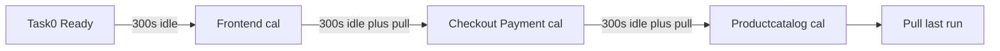

# Frozen-capacity μ calibration — implementation plan

> **For agentic workers:** REQUIRED SUB-SKILL: Use superpowers:subagent-driven-development (recommended) or superpowers:executing-plans to implement this plan task-by-task. Steps use checkbox (`- [ ]`) syntax for tracking. **Task 1 is a hard stop** — do not begin Task 0, Task 2, or Task 3 until the user has reviewed Task 1's findings and explicitly said to continue. Do not start the VMs before that stop (Task 1 is local CSV analysis; idle VMs cost money). After the continue: Task 0 (VMs) and Task 2 (YAML configs) can run in parallel; Task 3 waits for both. This plan should be saved to `docs/superpowers/plans/2026-09-18-frozen-capacity-calibration.md` once approved.

**Goal:** Get a real, non-circular `mu_per_millicore` frozen for `frontend`, `checkoutservice`, `productcatalogservice`, and `paymentservice` in `experiments/capacity/capacity_frozen.json`, replacing the current all-`not_yet_calibrated` skeleton, so `rho_frozen_report.py` can report a real `rho_hat` instead of `n/a` for every run.

**Architecture:** No new production code paths — `experiments/capacity_frozen.py` (`freeze` subcommand) and `experiments/rho_frozen_report.py` already exist and are correct (see [`docs/superpowers/specs/2026-09-17-frozen-capacity-rho-design.md`](docs/superpowers/specs/2026-09-17-frozen-capacity-rho-design.md)). What's missing is (a) understanding why the one existing `mu_sat` data point we have is unusable, and (b) actually producing saturating traffic against each of the 4 services with TopFull and RetryGuard both off, at their **full, unconstrained** CPU limits (not the artificially-starved S3/S4 100m/50m/100m limits), so the frozen value isn't a contaminated or hard-to-rescale number.

**Tech Stack:** Python 3 (stdlib only, matches `estimate_service_mu.py`/`capacity_frozen.py`), existing `run_scenario.py` / `pull_results.py` orchestration over SSH to the 3 GCP VMs, PowerShell for local commands (this is a Windows workstation).

## Global Constraints

- Never overwrite an existing results folder — always bump `run_number`/`log_folder` before reusing a scenario config (AGENTS.md §6).
- Millicore source for any μ/ρ calculation is **`service_capacity.json`** (kubectl snapshot), never `topfull_run_quotas.json` or `run_manifest.json`'s `effective_cpu_quotas` (spec §3.3) — the existing tools already enforce this; do not change that.
- `cluster_shape` must stay `"topfull-worker-1=e2-standard-16"` — do not calibrate against a different VM size without a full re-calibration (spec §7.5). Verify machine types before running (`gcloud compute instances list`).
- `capacity_frozen.py freeze` only supports `method="mu_sat"` in v1 — do not implement ramp-to-plateau (spec §3.2) as part of this plan.
- Calibration only covers the minimum set: `frontend`, `checkoutservice`, `productcatalogservice`, `paymentservice`. Do not add entries for other Boutique services.
- This plan deliberately raises Locust user counts for two new calibration-only scenario configs, which AGENTS.md flags as normally needing "a separate load-calibration decision" — this plan **is** that decision, scoped only to these two new files, not a general load bump to any existing scenario config.
- Do not modify `experiments/retryguard.py`'s live controller logic — it stays on its own rejection-rate surrogate, unaffected by anything here (spec §8).
- Always use SSH host aliases (`topfull-master`, `topfull-worker-1`, `topfull-load`), never raw IPs (`.cursor/rules/topfull-ssh.mdc`).
- **300 s cool-off after every calibration run, before the next one starts.** Clock starts when `run_scenario.py` exits (load is already stopped). `pull_results.py` may run *during* that wait — it is local `scp`, not extra cluster load. Same 300 s idle after Task 0 declares the cluster Ready, before the first calibration run, so boot leftover / prior-session traffic does not contaminate measurements. Do not skip or shorten this. Matches the campaign convention used for the S3→S1→S2 sextet (AGENTS.md §4).
- "Best effort" for backends (per explicit user instruction): if a calibration run does not produce a `mu_sat` sample after one attempt with boosted load, do not build new tooling (e.g. a direct gRPC micro-benchmark) to force it — record it as `not_yet_calibrated` with a note, and move on.

---

### Task 1: Diagnose whether checkoutservice's S3-RG-run8 overload was 5xx-driven or reset-driven — **STOP for user review after this task**

**Files:**
- Read-only: `experiments/results/campaign_48/S3_targeted_bottleneck/run_topfull_retryguard_targeted_bottleneck_run8/service_inbound.csv` (columns confirmed: `timestamp,service,total,2xx,4xx,5xx,resets,rq_time_sum_ms,rq_time_count,rq_time_buckets` — cumulative counters, need deltas between consecutive ticks)
- Create (temporary, not committed): `experiments/scratch_diagnose_run8_checkout.py`

**Interfaces:** None — standalone read-only analysis script, no dependency on other tasks.

**Context:** `estimate_service_mu.py`'s `mu_sat` only samples ticks where `Δ5xx/Δtotal >= SAT_5XX_FRACTION` (0.05, `estimate_service_mu.py:75`). The pulled `rho_estimate_report.json` for this run shows `checkoutservice.mu_sat = null` and `checkoutservice.inbound_5xx_fraction = 0.0` for the **entire run**, even though `retryguard.log` (baked into that same run's `rho_estimate_report.json` `toggle_events`) recorded 8 `ON→OFF` events on `checkoutservice` at rejection 0.37–0.69 (RetryGuard's own surrogate metric, `Δ(5xx + resets)/Δtotal`). This task proves — from the raw per-tick CSV, not the aggregate — whether that gap is because the overload showed up entirely as connection `resets` rather than HTTP `5xx` status codes.

- [ ] **Step 1: Write the diagnostic script**

Create `experiments/scratch_diagnose_run8_checkout.py`:

```python
"""One-off diagnostic: is checkoutservice's overload in S3 RG run8 driven by
5xx status codes or connection resets? Read-only, not committed."""
import csv
from datetime import datetime, timezone

PATH = (
    "experiments/results/campaign_48/S3_targeted_bottleneck/"
    "run_topfull_retryguard_targeted_bottleneck_run8/service_inbound.csv"
)

TOGGLE_TIMES = [
    "2026-09-16T20:45:47Z", "2026-09-16T20:46:52Z", "2026-09-16T20:47:59Z",
    "2026-09-16T20:49:08Z", "2026-09-16T20:50:17Z", "2026-09-16T20:51:20Z",
    "2026-09-16T20:52:49Z", "2026-09-16T20:53:55Z",
]


def parse_ts(s: str) -> datetime:
    return datetime.strptime(s, "%Y-%m-%dT%H:%M:%SZ").replace(tzinfo=timezone.utc)


def main() -> None:
    rows = []
    with open(PATH, newline="", encoding="utf-8") as f:
        for row in csv.DictReader(f):
            if row["service"] == "checkoutservice":
                rows.append(row)
    rows.sort(key=lambda r: parse_ts(r["timestamp"]))

    toggle_dts = [parse_ts(t) for t in TOGGLE_TIMES]
    max_5xx_frac = 0.0
    max_reset_frac = 0.0
    max_combined_frac = 0.0
    near_toggle_report = []

    for prev, cur in zip(rows, rows[1:]):
        dt = (parse_ts(cur["timestamp"]) - parse_ts(prev["timestamp"])).total_seconds()
        if dt <= 0:
            continue
        d_total = int(cur["total"]) - int(prev["total"])
        d_5xx = int(cur["5xx"]) - int(prev["5xx"])
        d_resets = int(cur["resets"]) - int(prev["resets"])
        if d_total <= 0:
            continue
        f5xx = d_5xx / d_total
        freset = d_resets / d_total
        fcombined = (d_5xx + d_resets) / d_total
        max_5xx_frac = max(max_5xx_frac, f5xx)
        max_reset_frac = max(max_reset_frac, freset)
        max_combined_frac = max(max_combined_frac, fcombined)
        cur_dt = parse_ts(cur["timestamp"])
        if any(abs((cur_dt - t).total_seconds()) <= 5 for t in toggle_dts):
            near_toggle_report.append(
                (cur["timestamp"], d_total, d_5xx, d_resets,
                 round(f5xx, 3), round(freset, 3), round(fcombined, 3))
            )

    print(f"max delta_5xx/delta_total over whole run:    {max_5xx_frac:.4f}")
    print(f"max delta_resets/delta_total over whole run: {max_reset_frac:.4f}")
    print(f"max delta_(5xx+resets)/delta_total over run: {max_combined_frac:.4f}")
    print()
    print("ticks within 5s of a RetryGuard toggle event:")
    print("timestamp | d_total | d_5xx | d_resets | 5xx_frac | reset_frac | combined_frac")
    for r in near_toggle_report:
        print(r)


if __name__ == "__main__":
    main()
```

- [ ] **Step 2: Run it**

```powershell
python experiments/scratch_diagnose_run8_checkout.py
```

Expected: `max delta_5xx/delta_total` stays near 0 (consistent with the aggregate `inbound_5xx_fraction=0.0` already seen in `rho_estimate_report.json`), while `max delta_resets/delta_total` and the per-toggle rows show fractions in the 0.3–0.7 range lining up with RetryGuard's logged rejection values (0.37–0.69) — confirming the overload was reset-driven, not 5xx-driven.

- [ ] **Step 3: Delete the scratch script**

```powershell
Remove-Item experiments/scratch_diagnose_run8_checkout.py
```

Do not commit it — it was a one-off diagnostic, not project tooling.

- [ ] **Step 4: STOP.** Report the printed numbers to the user. Do not start Task 0, Task 2, or Task 3 until they've reviewed this finding and said to continue. If the numbers come out differently than expected (e.g. 5xx fraction is *not* near zero), stop and re-discuss the rest of this plan — Tasks 2–6 below assume checkout's (and by extension payment's, same call path) overload signal is reset-driven, which has a direct consequence: **`mu_sat`'s definition (5xx-only) may never populate for these services no matter how hard Task 3's calibration run pushes traffic.** That risk is accepted per the "best effort" constraint above, not something this plan fixes by changing `estimate_service_mu.py`'s saturation definition.

---

### Task 0: Start the VMs and confirm they are ready

**When to run:** After Task 1's user-review stop. Task 2 (YAML) can run in parallel while the VMs boot. Task 3 must not start until this task's health checks pass.

**Files:** none created/modified. Follow [CONNECT-VMS.md](Guides%20and%20Info/CONNECT-VMS.md) short path ("Reconnect after VMs were stopped"). Always `User: idozacharia` on all three VMs.

**Interfaces:**
- Consumes: none.
- Produces: three `RUNNING` VMs with current IPs in `~/.ssh/config`, a Ready Kubernetes cluster, Boutique pods `Running` `2/2` at paper CPU limits, worker SKU `e2-standard-16`.

- [ ] **Step 1: Confirm gcloud project and list instances**

```powershell
gcloud config set project networks-workshop
gcloud compute instances list --format="table(name,status,machineType.basename(),networkInterfaces[0].accessConfigs[0].natIP)"
```

Expected: `topfull-master`, `topfull-worker-1`, `topfull-load` all listed. `topfull-worker-1` machine type must be `e2-standard-16` (`cluster_shape` is `topfull-worker-1=e2-standard-16`). If the worker is a different SKU, **stop** — do not calibrate on the wrong shape.

- [ ] **Step 2: Start any VM that is not `RUNNING`**

```powershell
gcloud compute instances start topfull-master topfull-worker-1 topfull-load --zone=us-central1-a
gcloud compute instances list --format="table(name,status,networkInterfaces[0].accessConfigs[0].natIP)"
```

Require `STATUS=RUNNING` and a non-empty `NAT_IP` for each. Store `IP_MASTER`, `IP_WORKER`, `IP_LOAD`.

- [ ] **Step 3: Refresh `HostName` in `~/.ssh/config`**

Ephemeral IPs change after every stop/start. Update only the three `Host topfull-*` blocks (leave other Hosts untouched). Then verify:

```powershell
ssh -o BatchMode=yes -o ConnectTimeout=8 topfull-master "hostname; whoami"
ssh -o BatchMode=yes -o ConnectTimeout=8 topfull-worker-1 "hostname; whoami"
ssh -o BatchMode=yes -o ConnectTimeout=8 topfull-load "hostname; whoami"
```

Expected: `whoami` is `idozacharia` on every VM. If `Permission denied`, follow CONNECT-VMS.md §Key install (`idoza` + `sudo bash /tmp/install_key.sh`). If timeout, IPs are still stale or the VM is not actually up.

- [ ] **Step 4: Wait until Kubernetes is actually Ready**

After a start, `kubectl` can fail even when SSH works (static pods still booting, or missing `~/.kube/config` for this user). Poll until nodes are Ready:

```powershell
ssh -o BatchMode=yes -o ConnectTimeout=8 topfull-master "kubectl get nodes; kubectl get pods -n default; kubectl get virtualservices -n default"
```

Expected: both nodes `Ready`; Boutique pods `Running` `2/2`; VirtualServices present. If `connection to localhost:8080 refused` and kubelet is up, this is usually a missing kubeconfig for the SSH user — copy from `idozacharia` per AGENTS.md §7, do not treat it as API-server-down.

- [ ] **Step 5: Confirm paper CPU limits (no leftover S3/S4 constraint)**

```powershell
ssh topfull-master "kubectl get deploy -n default -o custom-columns=NAME:.metadata.name,CPU_LIMIT:.spec.template.spec.containers[0].resources.limits.cpu"
```

Expected: `checkoutservice` 1000m, `productcatalogservice` 500m, `paymentservice` 1000m, `frontend` 1000m. If any are still at a constrained leftover (100m / 50m), the runner will reconcile at the start of each `run_scenario.py`, but wait until they are paper values before Task 3 so the first calibration run is not measuring a healing rollout.

- [ ] **Step 6: Clear stale `/tmp` runner scripts**

```powershell
ssh topfull-master "sudo rm -f /tmp/rg_proxy.sh /tmp/rg_rl.sh /tmp/rg_mc.sh /tmp/rg_retryguard.sh /tmp/rg_envoy_retry.sh /tmp/rg_resource_usage.sh /tmp/rg_topfull_throttle.sh /tmp/rg_locust_launch.sh /tmp/envoy_retry_params.json"
```

- [ ] **Step 7: Cluster is ready.** Hand off to Task 3 only after Task 2's configs exist. Task 3 still sleeps 300 s of idle *after this step* before the first Locust run.

---

### Task 2: Create two new calibration-only scenario configs (full CPU, TopFull off, RetryGuard off)

**Files:**
- Create: `experiments/configs/scenario_calibration_checkout_payment_full_cpu.yaml`
- Create: `experiments/configs/scenario_calibration_productcatalog_full_cpu.yaml`
- No change needed to `experiments/configs/scenario_2_baseline_no_topfull.yaml` — it already covers frontend (full CPU, TopFull off, RetryGuard off) and its `run_number: 2` / `log_folder: baseline_no_topfull_sustained_overload_run2` slot is already the next free one per AGENTS.md.

**Interfaces:**
- Consumes: none.
- Produces: two YAML configs consumed by `run_scenario.py`/`pull_results.py` in Task 3, and by `capacity_frozen.py freeze` in Task 5 (via their resulting run folders' `service_capacity.json` + `service_inbound.csv`).

Both new configs follow the exact pattern of `experiments/configs/scenario_2_baseline_no_topfull.yaml` (`scale_constraints: []`, `topfull_rl.enabled: false`, `retryguard.enabled: false`, all 3 collectors on) but deliberately push much more load at the one Locust flow that drives the target backend, since at full (uncapped) CPU these backends need far more traffic than any existing scenario generates to have a chance of saturating (checkoutservice/paymentservice currently see ~10-20 req/s in every S1-S4 run at full CPU — nowhere near a 1000m ceiling). Both use `scenario_id` values outside the 1-6 range used by the real scenario matrix (`scenario_dir_name()` in `experiments/run_scenario.py:1100` returns `""` for unrecognized ids, so these land directly under `experiments/results/campaign_48/` rather than inside a real S3/S4 subfolder — keeping calibration-only data visibly separate from the matrix).

- [ ] **Step 1: Create the checkout+payment calibration config**

`experiments/configs/scenario_calibration_checkout_payment_full_cpu.yaml`:

```yaml
# ─────────────────────────────────────────────────────────────────────────────
# Calibration — checkoutservice + paymentservice, FULL CPU, TopFull+RG OFF
#
# Not part of the S1-S6 scenario matrix. Purpose: drive checkoutservice and
# paymentservice (paymentservice is only reachable via checkout) toward their
# own saturation at their normal, unconstrained paper CPU limits (checkout
# 1000m, payment 1000m) — NOT the artificially-starved S3/S4B limits
# (100m each). TopFull RL and RetryGuard are both off so neither one's
# admission control / retry suppression masks the raw ceiling.
#
# Lever: postcheckout is the only Locust flow that reaches both checkout and
# payment, so it is pushed far above every existing scenario's postcheckout
# count (20) to have any chance of reaching a 1000m ceiling. Best-effort:
# if this still does not produce a mu_sat sample, do not extend this config
# further — record as not_yet_calibrated per this plan's Task 4/5.
# ─────────────────────────────────────────────────────────────────────────────

scenario_id: 30
scenario_name: calibration_checkout_payment_full_cpu
condition: calibration
run_number: 1
description: >
  Calibration-only run. Full (unconstrained) CPU for checkoutservice and
  paymentservice. TopFull RL off, RetryGuard off. Heavy postcheckout load to
  attempt real saturation for mu_sat.

duration_seconds: 900

locust:
  user_counts:
    getproduct:   50
    postcheckout: 500
    getcart:      50
    postcart:     50
    emptycart:    50
  spawn_rate: 150
  scripts:
    - online_boutique_create.sh
    - online_boutique_create2.sh

scale_constraints: []

retries:
  attempts_on: 3
  attempts_off: 0
  per_try_timeout_ms: 500

topfull_rl:
  enabled: false

retryguard:
  enabled: false
  rejection_threshold: 0.20
  sample_interval_seconds: 1
  interval_samples: 30

envoy_retry_collector:
  enabled: true
  poll_interval_seconds: 1
  transport: network_prometheus
  max_workers: 4

resource_usage_collector:
  enabled: true
  poll_interval_seconds: 5

topfull_throttle_collector:
  enabled: true
  poll_interval_seconds: 1

log_folder: calibration_checkout_payment_full_cpu_run1

infra:
  master_ssh_host: topfull-master
  loadgen_ssh_host: topfull-load
  topfull_src_path: /home/idozacharia/TopFull/TopFull_master/online_boutique_scripts/src
  topfull_loadgen_path: /home/idozacharia/TopFull/TopFull_loadgen
  venv_activate: /home/idozacharia/TopFull/venv/bin/activate
  results_base_path: /home/idozacharia/experiments/results
  retryguard_script: /home/idozacharia/experiments/retryguard.py
  envoy_retry_collector_script: /home/idozacharia/experiments/envoy_retry_collector.py
  resource_usage_collector_script: /home/idozacharia/experiments/resource_usage_collector.py
  topfull_throttle_collector_script: /home/idozacharia/experiments/topfull_throttle_collector.py
```

- [ ] **Step 2: Create the productcatalog calibration config**

`experiments/configs/scenario_calibration_productcatalog_full_cpu.yaml`:

```yaml
# ─────────────────────────────────────────────────────────────────────────────
# Calibration — productcatalogservice, FULL CPU, TopFull+RG OFF
#
# Not part of the S1-S6 scenario matrix. Purpose: drive productcatalogservice
# toward its own saturation at its normal, unconstrained paper CPU limit
# (500m) — NOT the artificially-starved S4A limit (50m). TopFull RL and
# RetryGuard are both off so neither masks the raw ceiling.
#
# Lever: getproduct is the primary Locust flow into productcatalogservice
# (also reached indirectly via checkout), pushed far above every existing
# scenario's getproduct count (100) to have any chance of reaching a 500m
# ceiling. Best-effort: if this still does not produce a mu_sat sample, do
# not extend this config further — record as not_yet_calibrated per this
# plan's Task 4/5.
# ─────────────────────────────────────────────────────────────────────────────

scenario_id: 40
scenario_name: calibration_productcatalog_full_cpu
condition: calibration
run_number: 1
description: >
  Calibration-only run. Full (unconstrained) CPU for productcatalogservice.
  TopFull RL off, RetryGuard off. Heavy getproduct load to attempt real
  saturation for mu_sat.

duration_seconds: 900

locust:
  user_counts:
    getproduct:   800
    postcheckout: 20
    getcart:      50
    postcart:     50
    emptycart:    50
  spawn_rate: 150
  scripts:
    - online_boutique_create.sh
    - online_boutique_create2.sh

scale_constraints: []

retries:
  attempts_on: 3
  attempts_off: 0
  per_try_timeout_ms: 500

topfull_rl:
  enabled: false

retryguard:
  enabled: false
  rejection_threshold: 0.20
  sample_interval_seconds: 1
  interval_samples: 30

envoy_retry_collector:
  enabled: true
  poll_interval_seconds: 1
  transport: network_prometheus
  max_workers: 4

resource_usage_collector:
  enabled: true
  poll_interval_seconds: 5

topfull_throttle_collector:
  enabled: true
  poll_interval_seconds: 1

log_folder: calibration_productcatalog_full_cpu_run1

infra:
  master_ssh_host: topfull-master
  loadgen_ssh_host: topfull-load
  topfull_src_path: /home/idozacharia/TopFull/TopFull_master/online_boutique_scripts/src
  topfull_loadgen_path: /home/idozacharia/TopFull/TopFull_loadgen
  venv_activate: /home/idozacharia/TopFull/venv/bin/activate
  results_base_path: /home/idozacharia/experiments/results
  retryguard_script: /home/idozacharia/experiments/retryguard.py
  envoy_retry_collector_script: /home/idozacharia/experiments/envoy_retry_collector.py
  resource_usage_collector_script: /home/idozacharia/experiments/resource_usage_collector.py
  topfull_throttle_collector_script: /home/idozacharia/experiments/topfull_throttle_collector.py
```

- [ ] **Step 3: Commit**

```powershell
git add experiments/configs/scenario_calibration_checkout_payment_full_cpu.yaml experiments/configs/scenario_calibration_productcatalog_full_cpu.yaml
git commit -m "Add full-CPU TopFull/RetryGuard-off calibration scenario configs."
```

---

### Task 3: Run the 3-run calibration battery (300 s cool-off after every run)

**Files:** none created/modified — operational task against the live VMs. Task 0 must already have passed.

**Cool-off rule (do not skip):** 300 seconds of idle cluster after Task 0 is Ready (before run 1), and again after each `run_scenario.py` exits before the next `run_scenario.py` starts. Pull during the wait. No cool-off after the last run.

Sequence:



**Interfaces:**
- Consumes: Task 0 Ready cluster; the 3 configs from Task 2 (`scenario_2_baseline_no_topfull.yaml` already existing at `run_number: 2`, plus the 2 new files).
- Produces: 3 new local result folders under `experiments/results/campaign_48/` (frontend TopFull-off run lands in `S2_sustained_overload/` because `scenario_id: 2`; calibration ids 30/40 land at the `campaign_48/` root) each with `service_capacity.json`, `service_inbound.csv`, `rho_estimate_report.{md,json}` (auto-generated by `pull_results.py`).

- [ ] **Step 1: Cool off 300 s after Task 0, before the first Locust run**

```powershell
Start-Sleep -Seconds 300
```

This is not optional. Boot, kubelet catch-up, and any leftover from a prior session would otherwise show up in the first run's `mu_sat` / λ.

- [ ] **Step 2: Run frontend calibration (TopFull-off, already-prepared config)**

```powershell
python experiments/run_scenario.py experiments/configs/scenario_2_baseline_no_topfull.yaml
```

Wait for the run to finish (600s duration + startup/collection overhead).

- [ ] **Step 3: Cool off 300 s after the frontend run; pull during the wait**

```powershell
python experiments/pull_results.py experiments/configs/scenario_2_baseline_no_topfull.yaml
Start-Sleep -Seconds 300
```

Do not start the next `run_scenario.py` until this sleep finishes.

- [ ] **Step 4: Run checkout+payment calibration**

```powershell
python experiments/run_scenario.py experiments/configs/scenario_calibration_checkout_payment_full_cpu.yaml
```

- [ ] **Step 5: Cool off 300 s after checkout+payment; pull during the wait**

```powershell
python experiments/pull_results.py experiments/configs/scenario_calibration_checkout_payment_full_cpu.yaml
Start-Sleep -Seconds 300
```

- [ ] **Step 6: Run productcatalog calibration**

```powershell
python experiments/run_scenario.py experiments/configs/scenario_calibration_productcatalog_full_cpu.yaml
```

- [ ] **Step 7: Pull the last run (no further cool-off unless another run is added)**

```powershell
python experiments/pull_results.py experiments/configs/scenario_calibration_productcatalog_full_cpu.yaml
```

- [ ] **Step 8: Confirm the 3 result folders exist locally with the expected files**

```powershell
Get-ChildItem "experiments/results/campaign_48" -Recurse -Include "service_capacity.json","service_inbound.csv","rho_estimate_report.json" | Where-Object { $_.FullName -match "no_topfull_sustained_overload_run2|calibration_checkout_payment_full_cpu_run1|calibration_productcatalog_full_cpu_run1" }
```

Expected: 9 files (3 per folder).

---

### Task 4: Check whether each service actually got a real `mu_sat` sample

**Files:** Read-only: the 3 `rho_estimate_report.json` files from Task 3.

**Interfaces:**
- Consumes: `rho_estimate_report.json`'s `estimates[].service` / `.mu_sat` / `.n_ticks_with_latency` fields (schema already defined in `experiments/estimate_service_mu.py`).
- Produces: a go/no-go decision per service for Task 5.

- [ ] **Step 1: Inspect frontend's report**

```powershell
$j = Get-Content "experiments/results/campaign_48/S2_sustained_overload/baseline_no_topfull_sustained_overload_run2/rho_estimate_report.json" -Raw | ConvertFrom-Json
$j.estimates | Where-Object { $_.service -eq "frontend" } | Select-Object service, mu_sat, lambda_mean, inbound_5xx_fraction
```

- [ ] **Step 2: Inspect checkout+payment report**

```powershell
$j = Get-Content "experiments/results/campaign_48/calibration_checkout_payment_full_cpu_run1/rho_estimate_report.json" -Raw | ConvertFrom-Json
$j.estimates | Where-Object { $_.service -in @("checkoutservice","paymentservice") } | Select-Object service, mu_sat, lambda_mean, inbound_5xx_fraction
```

(Path may instead be under `experiments/results/campaign_48/` root without a scenario subfolder — check both, since `scenario_id: 30` is unrecognized by `scenario_dir_name()`.)

- [ ] **Step 3: Inspect productcatalog report**

```powershell
$j = Get-Content "experiments/results/campaign_48/calibration_productcatalog_full_cpu_run1/rho_estimate_report.json" -Raw | ConvertFrom-Json
$j.estimates | Where-Object { $_.service -eq "productcatalogservice" } | Select-Object service, mu_sat, lambda_mean, inbound_5xx_fraction
```

- [ ] **Step 4: Record the result per service**

For each of the 4 services, note whether `mu_sat` is a real number or `null`. Any `null` after this attempt is recorded in Task 5 as `not_yet_calibrated` with an explanatory note (per "best effort" — do not re-run with even more load, do not build a direct-gRPC micro-benchmark).

---

### Task 5: Freeze whichever services produced a real `mu_sat`

**Files:**
- Modify: `experiments/capacity/capacity_frozen.json` (via the `capacity_frozen.py freeze` CLI — do not hand-edit)
- Modify: `experiments/capacity/README.md` (update the "uncalibrated skeleton" language once real values exist)

**Interfaces:**
- Consumes: `experiments/capacity_frozen.py`'s existing `freeze_service(run_dir, service, *, method="mu_sat", force, table_path, cluster_shape)` (already implemented, `experiments/capacity_frozen.py:184`) via its CLI (`experiments/capacity_frozen.py:252`).
- Produces: an updated `capacity_frozen.json` with real `mu_per_millicore`/`method="mu_sat"`/`source_run`/`n_sat_ticks` for any service that got a sample in Task 4.

- [ ] **Step 1: Freeze frontend (if Task 4 found a real `mu_sat`)**

```powershell
python experiments/capacity_frozen.py freeze "experiments/results/campaign_48/S2_sustained_overload/baseline_no_topfull_sustained_overload_run2" --service frontend --force
```

Expected stdout: `froze frontend mu_per_millicore=<number> -> experiments\capacity\capacity_frozen.json`

- [ ] **Step 2: Freeze checkoutservice and paymentservice (if Task 4 found real `mu_sat` for either)**

```powershell
python experiments/capacity_frozen.py freeze "experiments/results/campaign_48/calibration_checkout_payment_full_cpu_run1" --service checkoutservice --force
python experiments/capacity_frozen.py freeze "experiments/results/campaign_48/calibration_checkout_payment_full_cpu_run1" --service paymentservice --force
```

If either raises `FrozenCapacityError: mu_sat unavailable for <service> (no saturating 5xx ticks)` — per Task 1's finding this is expected if the overload stayed reset-driven even at full CPU. Leave that entry as `not_yet_calibrated`; do not treat this as a bug to fix in this plan.

- [ ] **Step 3: Freeze productcatalogservice (if Task 4 found a real `mu_sat`)**

```powershell
python experiments/capacity_frozen.py freeze "experiments/results/campaign_48/calibration_productcatalog_full_cpu_run1" --service productcatalogservice --force
```

- [ ] **Step 4: Verify the resulting table**

```powershell
Get-Content "experiments/capacity/capacity_frozen.json" -Raw | ConvertFrom-Json | Select-Object -ExpandProperty capacities
```

Confirm every successfully-frozen service shows `method: "mu_sat"`, a numeric `mu_per_millicore`, and `source_run` pointing at the calibration folder — and confirm any service that Task 4 found `null` for still shows `method: "not_yet_calibrated"`.

- [ ] **Step 5: Update `experiments/capacity/README.md`**

Replace the current "uncalibrated skeleton" note with an accurate description of which services are now calibrated (with source runs) and which remain `not_yet_calibrated` and why (reset-driven overload, not a tooling gap).

- [ ] **Step 6: Commit**

```powershell
git add experiments/capacity/capacity_frozen.json experiments/capacity/README.md
git commit -m "Freeze real mu_per_millicore from full-CPU TopFull/RetryGuard-off calibration runs."
```

---

### Task 6: Sanity-check `rho_hat` on real campaign runs and update AGENTS.md

**Files:**
- Read-only: any two representative pulled runs, e.g. `experiments/results/campaign_48/S1_normal_op/baseline_topfull_no_retryguard_normal_op_run24` and `experiments/results/campaign_48/S2_sustained_overload/baseline_topfull_no_retryguard_sustained_overload_run23`.
- Modify: `AGENTS.md` (§4 "Current status")

**Interfaces:**
- Consumes: `experiments/rho_frozen_report.py`'s existing `generate_report(run_dir, table_path=None, cluster_shape=...)` (already implemented, `experiments/rho_frozen_report.py:286`) via its CLI.

- [ ] **Step 1: Generate a report for the S1 baseline run**

```powershell
python experiments/rho_frozen_report.py "experiments/results/campaign_48/S1_normal_op/baseline_topfull_no_retryguard_normal_op_run24"
```

- [ ] **Step 2: Generate a report for the S2 baseline run**

```powershell
python experiments/rho_frozen_report.py "experiments/results/campaign_48/S2_sustained_overload/baseline_topfull_no_retryguard_sustained_overload_run23"
```

- [ ] **Step 3: Read both `rho_frozen_report.md` files and record the frontend `rho_hat` values** (and any other service that got calibrated). Compare against the team's earlier informal target band (S1 entry ~0.5-0.8, S2 entry >1) purely as a sanity check — not a requirement to hit that band.

- [ ] **Step 4: Update `AGENTS.md` §4** with a new dated entry: what was calibrated (which services, from which runs, `mu_per_millicore` values), which stayed `not_yet_calibrated` and why (reset-driven overload per Task 1), and the two sample `rho_hat` sanity-check numbers from Steps 1-3. Follow the existing terse, dated-bullet style already used throughout that section.

- [ ] **Step 5: Commit**

```powershell
git add AGENTS.md
git commit -m "Record frozen-capacity calibration results and rho_hat sanity check in AGENTS.md."
```

---

## Self-review notes

- **Spec coverage:** Task 2's two new configs implement spec §3.0/§3.1 ("throughput per millicore from a saturating run, not an absolute rate, at the service's *own* CPU limit"). Task 5 uses the existing `capacity_frozen.py freeze` exactly as designed (spec §5.2). Task 6 uses `rho_frozen_report.py` exactly as designed (spec §5.3). Ramp-to-plateau (spec §3.2) is explicitly out of scope per Global Constraints.
- **Infra:** Task 0 is the CONNECT-VMS short path plus Ready/paper-CPU/SKU checks. VMs stay off until after Task 1 review.
- **Cool-off:** 300 s after Task 0 Ready (before run 1) and after every `run_scenario.py` before the next; pull during the wait.
- **Placeholder scan:** all commands and YAML content above are complete and copy-pasteable; no "TODO"/"add appropriate handling" left in.
- **Risk called out explicitly, not hidden:** Task 1's expected finding (reset-driven, not 5xx-driven overload) directly threatens Task 3's chance of success for checkout/payment — this is stated in Task 1 Step 4 and Task 5 Step 2, not glossed over.
